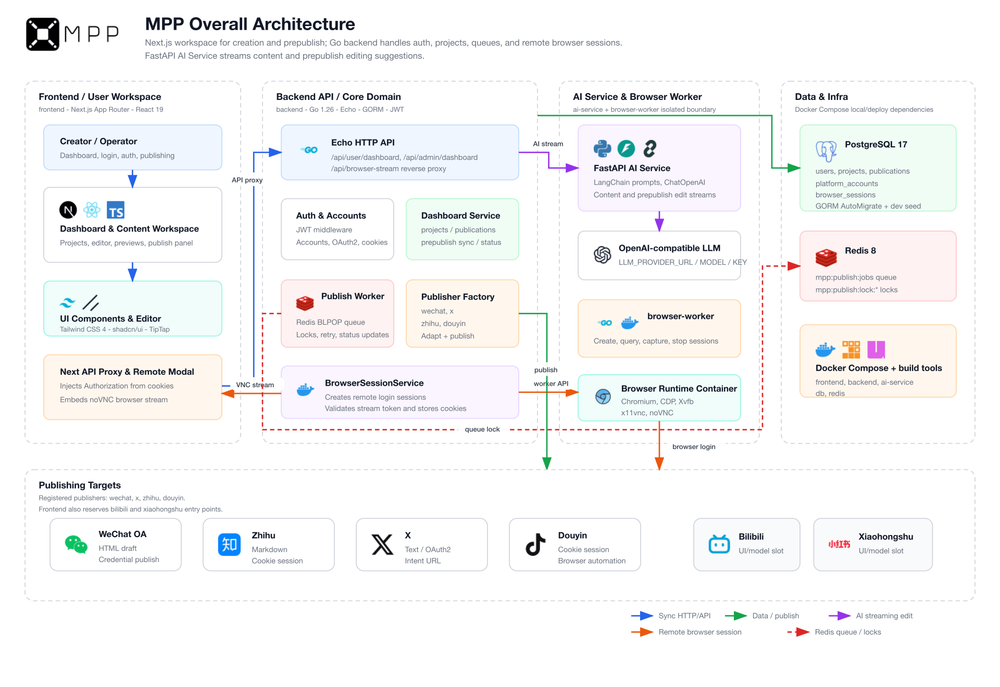

# MPP: multi-platform-poster

  
   
  

## Overview

MPP is a multi-platform content publishing system for creators and operations teams. It helps manage content projects, platform-specific adaptation, publishing status tracking, and AI-assisted processing from a unified workspace.

## Project Innovations

MPP focuses its innovation on platform-specific draft adaptation, third-party platform isolation, remote login, reviewable AI editing, and VM-style publishing execution without requiring browser plugins.

### 1. Explicit pre-publish adaptation pipeline

MPP separates source draft saving from platform draft generation. Users maintain one canonical source draft, then sync it into platform-specific derived drafts during the pre-publish stage:

- WeChat Official Accounts use HTML drafts.
- Zhihu uses Markdown drafts.
- X uses length-limited plain text.
- Future platforms can extend this model to image posts, video feeds, note-style posts, and other content formats.

Each derived draft can record `schema_version`, `format`, `source_revision`, `generated_by`, and asset metadata, making the adaptation process easier to preview, debug, trace, and extend with future AI agent intervention.

### 2. Platform adapters isolate third-party differences

Platform-specific rules are contained behind publisher and adapter boundaries. The backend workflow only needs to coordinate projects, platform targets, state transitions, and publishing jobs. When adding a new platform, the system can implement configuration validation, content adaptation, account connection, and publishing behavior around a stable platform key without changing the editor core or the general publishing flow.

This allows API-based platforms and browser-based platforms to coexist. WeChat Official Accounts and X can use official APIs or OAuth, while platforms such as Douyin and Zhihu that depend on web login state can reuse the remote browser capability.

### 3. Isolated remote browser login

For platforms that require cookie-based login or QR-code login, MPP uses a dedicated `browser-worker`. It starts a disposable Chromium runtime per session, streams the controlled browser to the user for login, and then lets the backend capture the required cookies and account information through CDP.

The frontend never receives raw cookies, CDP endpoints, or container details. Redis manages short-lived sessions, locks, stream tokens, and TTLs, while PostgreSQL stores auditable final state. This reduces the need for manual cookie copying while keeping sensitive browser state out of the frontend.

### 4. Reviewable AI streaming edit workflow

AI editing does not directly overwrite content. Instead, it follows a streaming generation, proposal preview, and diff confirmation workflow. The `ai-service` owns prompt construction and model calls, the Go backend handles authentication, context checks, and streaming proxying, and the frontend presents incremental output for user confirmation.

This lets AI assist with source draft polishing, platform draft rewriting, and pre-publish calibration while keeping a clear human review boundary before any generated content becomes official.

### 5. VM-style publishing execution without browser plugins

For platforms such as Zhihu and Douyin, where stable public publishing APIs may be unavailable or where publishing depends heavily on logged-in creator dashboards, MPP does not require users to install browser plugins. Instead, it uses a backend-controlled, VM-style browser runtime to complete login, draft filling, media upload, and publishing actions, turning platform operations into an auditable, queueable, retryable server-side workflow.

Compared with plugin-based automation, this approach gives the system a more consistent permission boundary and execution environment. Users only complete the required authorization inside the controlled remote browser; publishing logic is then executed by `browser-worker` and platform adapters instead of being scattered across local user browsers.

## Architecture

## How to Quick Start

See [Setup Guide](doc/setup.md)
