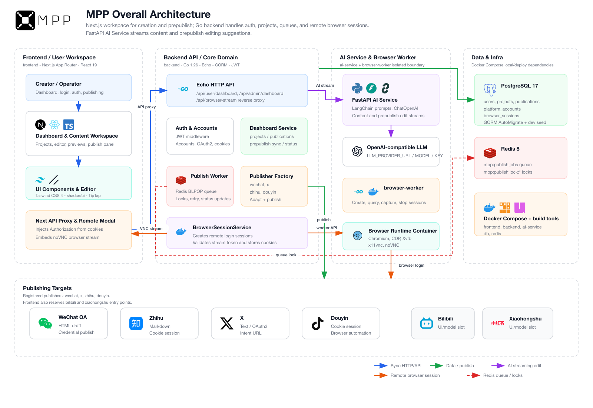

# MPP: multi-platform-poster

  
   
  

  <a href="README.md">English</a> | <strong>简体中文</strong>

## 项目概览

MPP 是面向内容创作者和运营团队的多平台内容发布系统。它把内容项目管理、平台草稿适配、发布状态追踪和 AI 辅助处理整合在同一个工作台中，帮助团队把从创作到发布的流程结构化、可追踪、可自动化。

## 演示视频

- [哔哩哔哩演示](https://www.bilibili.com/video/BV1wQVD6mEA6)

## 项目亮点

MPP 的目标是把多平台发布从零散操作变成结构清晰、可自动化的工作流。每个核心设计都对应一个具体的发布问题。

### 1. 平台草稿适配

MPP 引入发布前适配流水线，并使用带版本的 JSON 草稿契约保存平台派生内容。这解决了不同平台格式不一致的问题：微信公众号可以接收 HTML，知乎可以接收 Markdown，X 可以接收长度受限的纯文本，未来平台也可以扩展自己的草稿格式，而不需要改动编辑器核心。

### 2. 基于适配器的平台隔离

MPP 在 Go 后端中使用发布器和平台适配器接口隔离第三方规则，避免不同平台的账号模型、校验规则、接口风格和发布流程混入主业务逻辑。

### 3. 远程浏览器登录

MPP 引入 `browser-worker`、一次性 Chromium 会话、CDP Cookie 捕获、Redis 会话令牌和 PostgreSQL 审计记录。这用于支持抖音、知乎等需要 Cookie 或扫码登录的平台，同时避免把原始 Cookie、CDP 地址或浏览器状态暴露给前端。

### 4. 可审阅的 AI 编辑

MPP 使用独立的 FastAPI AI 服务、流式响应和“生成建议后确认”的工作流。AI 生成的改写会先进入预览和对比，用户确认后才会更新正式草稿，降低自动覆盖内容的风险。

### 5. 无插件的虚拟浏览器发布

对于缺少稳定公开发布 API 的平台，MPP 使用后端控制的虚拟浏览器运行时，而不是依赖浏览器插件。草稿填充、媒体上传和发布动作都保留在可审计的服务端流程中。

## 架构

模块设计说明见 [module-design.md](doc/module-design.md)。
按模块拆分的技术栈说明见 [tech-stack.md](doc/tech-stack.md)。

## 快速开始

请参考 [Setup Guide](doc/setup.md)。
