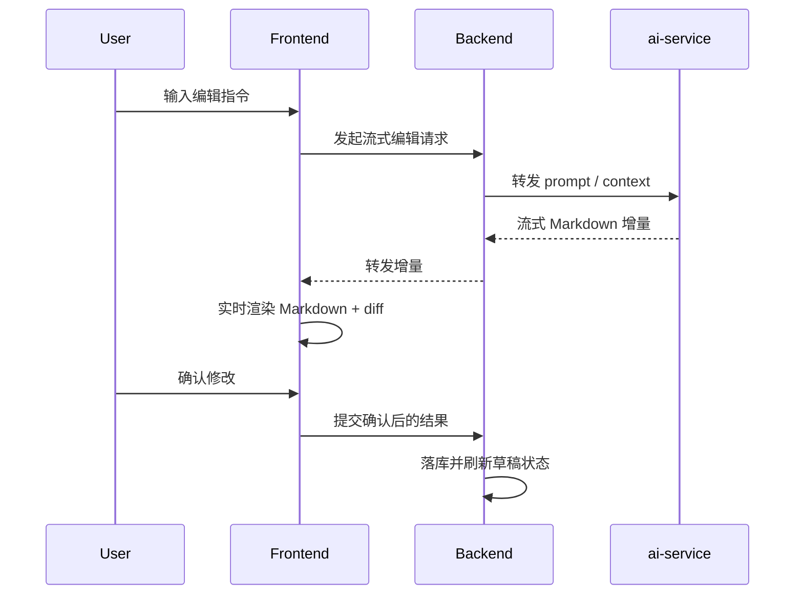

# AI 编辑流式工作流说明

## 目标

把内容编辑和预发布编辑从“单次返回结果”升级成“流式提案 + Git 风格差异确认”的工作流。

用户先看到 AI 增量生成的 Markdown 文本，再在差异视图里确认修改范围，最后才把变更落到编辑器或项目数据里。

## 推荐依赖

### 必选

- `react-markdown`
- `remark-gfm`
- `diff`
- `react-diff-view` 或 `@git-diff-view/react`
- `@tiptap/markdown@3.23.6`

### 说明

- `react-markdown` 负责把 AI 返回的 Markdown 渲染出来。
- `remark-gfm` 补齐表格、任务列表、删除线等常见 Markdown 能力。
- `diff` 用来生成旧内容和新内容之间的统一 diff。
- `@git-diff-view/react` 是更贴近 Git 代码评审的现成方案，React 19 兼容性更明确。
- `react-diff-view` 也是可行方案，适合消费 unified diff，再自己包一层 accept / reject。
- `@tiptap/markdown` 只在需要把 Markdown 直接落进 TipTap 编辑器时使用，版本要和现有 TipTap 统一到 `3.23.6`。

### 暂不建议先引入

- `@ai-sdk/react`

原因是我们当前是自有 Go backend + `ai-service`，先用原生 `fetch` 流式读取更轻。如果后端后面统一成 AI SDK stream protocol，再补这一层更合适。

## 职责划分

### Backend

- 作为鉴权入口，校验用户对项目 / publication 的访问权。
- 代理 AI 流式请求，不直接承载 prompt。
- 把 AI 流式结果转发给前端，保留 request id、abort、错误信息。
- 在用户确认后，才把建议内容写回项目或预发布草稿。
- 对已确认的变更生成一次新的项目版本或 publication 版本，方便回溯。

### ai-service

- 只负责 prompt、模型调用和流式输出。
- 根据场景拆成两个上下文：内容编辑和预发布编辑。
- 输出 Markdown 为主，不做数据库写入。
- 对外提供稳定的 provider 配置：`LLM_PROVIDER_URL`、`LLM_MODEL`、`LLM_PROVIDER_KEY`。
- 支持长请求、取消和超时，不阻塞后端。

## 预期数据流

## 后端要做什么

- 新增两个 AI 编辑通道：
  - 内容编辑
  - 预发布编辑
- 提供流式接口，前端可以边收边渲染。
- 维护“原文 / 建议稿 / 确认稿”三种状态，不直接覆盖原始内容。
- 生成可比对的变更片段，给前端 diff 视图用。
- 在确认前只保存草稿，不写最终内容。

## ai-service 要做什么

- 维护 prompt 模板和模型参数。
- 根据用户输入和上下文输出 Markdown 增量。
- 返回最终建议稿时，尽量保持结构稳定，方便前端做 diff。
- 只做文本生成，不做存储和权限判断。

## Agent 工作流

### 建议顺序

1. 先看现有页面和数据流，不直接开写。
2. 确认编辑结果是 Markdown、HTML 还是纯文本。
3. 确认流协议是普通 chunk、SSE，还是 AI SDK protocol。
4. 先落 `ai-service` 的 prompt 和流式输出。
5. 再接 backend 代理和鉴权。
6. 最后做前端的增量渲染、diff 视图、确认 / 取消。

### 推荐工具

- `rg` / `rg --files`：快速找现有实现和重复逻辑。
- `sed` / `cat`：看单文件上下文。
- `web`：查官方文档和库的最新约束。
- `pnpm view`：确认前端依赖版本、peerDependencies、兼容性。
- `apply_patch`：小步改代码和文档。
- `go test`、`pnpm test`、`python3 -m py_compile`：做针对性验证。
- `Browser`：验证本地页面的流式渲染和 diff 交互。

## 验证清单

- 流式编辑请求不会阻塞其他请求。
- Markdown 增量渲染结果和最终结果一致。
- Diff 视图能明确显示修改位置、前后变化和确认入口。
- 用户取消后，不会把建议稿误写入正式内容。

## 参考

- [Vercel AI SDK Stream Protocol](https://ai-sdk.dev/docs/ai-sdk-ui/stream-protocol)
- [react-markdown](https://github.com/remarkjs/react-markdown)
- [remark-gfm](https://github.com/remarkjs/remark-gfm)
- [jsdiff](https://github.com/kpdecker/jsdiff)
- [react-diff-view](https://github.com/otakustay/react-diff-view)
- [@git-diff-view/react](https://github.com/MrWangJustToDo/git-diff-view)
