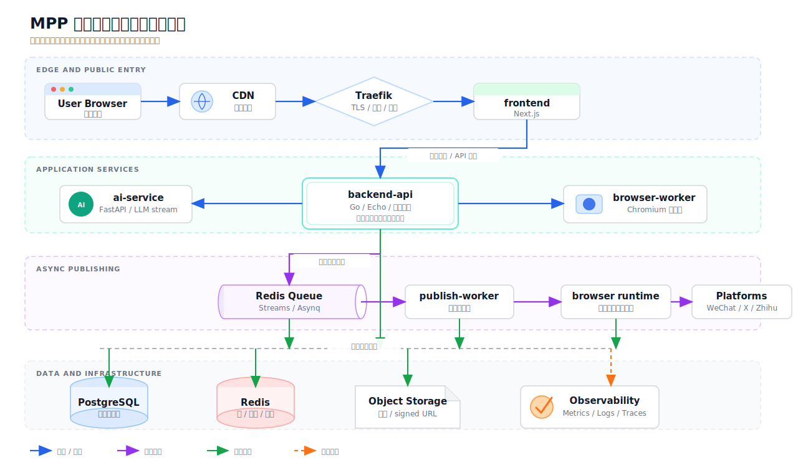

# MPP 高并发与分布式架构演进计划书

## 1. 背景

MPP 当前已经具备多服务雏形：

- `frontend`: Next.js SaaS 工作台与 API 代理入口。
- `backend`: Go API、用户态业务、发布编排、账号管理、任务协调。
- `ai-service`: FastAPI AI 编辑服务，负责提示词、模型调用和流式响应。
- `browser-worker`: 远程浏览器会话、Chromium 容器创建、销毁和登录态捕获。
- `PostgreSQL`: 持久化业务数据。
- `Redis`: 发布队列、分布式锁、OAuth 状态和临时会话状态。

这说明项目不需要从零开始引入“微服务架构”。更合适的方向是：保留 Go 后端作为业务核心，把高风险、高资源消耗、异步执行、外部依赖强的部分逐步演进成独立服务或 worker。

## 2. 目标

本计划的目标是提升 MPP 的并发承载、稳定性、安全性、可观测性、故障恢复能力和后续 SaaS 扩展能力。

每项设计都需要能落到 MPP 的实际业务场景中，避免引入当前阶段难以维护的复杂基础设施。

## 3. 设计原则

- 先用好现有 PostgreSQL、Redis、Docker Compose 和服务边界，再考虑引入更重的基础设施。
- 先解决入口安全、队列可靠性、幂等、限流、监控和故障隔离，再考虑 Kubernetes、Kafka、Service Mesh。
- 按运行特征拆分服务，而不是按业务名词硬拆微服务。
- 所有异步任务都要有幂等键、状态机、重试策略和可追踪日志。
- 所有外部平台调用都要可降级、可重试、可限流、可审计。

## 4. 推荐总体架构

## 5. 架构设计候选表

评分说明：

- 生产价值：1 低，5 高。
- 成本：1 低，5 高。
- 推荐优先级：P0 立即做，P1 优先做，P2 增长后做，P3 暂不建议。

| 序号 | 架构设计 | 解决的问题 | 项目落点 | 生产价值 | 成本 | 优先级 | 建议 |
| --- | --- | --- | --- | --- | --- | --- | --- |
| 1 | Traefik API Gateway | 统一入口、HTTPS、路由、内部服务隐藏 | 只暴露 `80/443`，隐藏 backend、AI、worker、DB、Redis | 5 | 2 | P0 | 很适合当前 Docker Compose 多服务形态 |
| 2 | 网关与应用双层限流 | 防止爬虫、恶意请求、AI 滥用、发布任务刷爆 | Traefik 做 IP 级限流，backend 做用户/租户/接口级配额 | 5 | 2 | P0 | SaaS 化关键能力 |
| 3 | 可观测性基线 | 出问题能定位，能展示系统真实运行状态 | Prometheus 指标、Grafana 面板、Loki 日志、Trace ID | 5 | 3 | P0 | 比盲目拆服务更有价值 |
| 4 | 健康检查与优雅关闭 | 支持滚动重启，避免请求中断 | frontend/backend/ai/browser-worker 增加 health/readiness | 5 | 2 | P0 | 成本低，生产必备 |
| 5 | API 服务无状态化与横向扩容 | 支撑更多并发请求 | backend 不保存本地会话，扩多副本，共享 Redis/Postgres | 5 | 2 | P1 | 当前架构已经接近可做 |
| 6 | Redis 队列升级为可靠任务模型 | 发布任务异步化、可重试、可恢复 | 用 Redis Streams 或 Asynq 管理 publish jobs | 5 | 3 | P1 | 比直接引入 Kafka 更划算 |
| 7 | 幂等键与发布状态机 | 防止重复点击、重复消费、重复发布 | publish 请求带 idempotency key，publication 状态机严格流转 | 5 | 3 | P1 | 高并发发布链路的核心保障 |
| 8 | Outbox Pattern | 数据库更新与事件投递一致性 | publication 状态更新后写 outbox，由 worker 投递任务 | 4 | 4 | P1 | 适合发布流水线，但实现要谨慎 |
| 9 | 分布式锁强化 | 避免同一 publication 被并发发布 | Redis lock 加 owner、TTL、续约、释放校验 | 5 | 2 | P1 | 项目已经有 Redis，成本可控 |
| 10 | 外部调用熔断、重试、退避 | 防止第三方平台或 LLM 故障拖垮系统 | AI、微信、知乎、X、抖音调用统一 retry/backoff/circuit breaker | 5 | 3 | P1 | 贴合多平台发布业务 |
| 11 | Browser Worker 资源池与配额 | 控制 Chromium 容器数量，避免宿主机爆掉 | 每用户/租户限制并发 browser session，全局 worker pool | 5 | 3 | P1 | 当前项目的高风险资源治理重点 |
| 12 | WebSocket/SSE 长连接治理 | 处理 AI stream 和远程浏览器 stream | 网关 timeout、连接数限制、stream token、断线恢复 | 4 | 3 | P1 | 直接影响流式体验和资源稳定性 |
| 13 | 数据库索引、分页与慢查询治理 | 避免列表和 dashboard 查询拖垮数据库 | projects、publications、sessions、accounts 建组合索引 | 5 | 2 | P1 | 成本低，收益高 |
| 14 | PostgreSQL 连接池 | 多副本后避免 DB 连接耗尽 | 引入 PgBouncer 或应用层连接池约束 | 4 | 3 | P2 | backend 扩容后再做 |
| 15 | 对象存储与签名 URL | 图片和媒体不压在应用容器与数据库上 | S3/R2/OSS 存储媒体，backend 生成 signed URL | 5 | 3 | P2 | 平台媒体上传增长后很重要 |
| 16 | CDN 与静态资源缓存 | 降低前端资源和图片访问压力 | Next 静态资源、媒体文件走 CDN | 4 | 2 | P2 | SaaS 上线后逐步做 |
| 17 | 多租户配额与计费限额 | SaaS 商业化与资源隔离 | tenant plan、AI 次数、发布次数、浏览器时长限制 | 5 | 4 | P2 | 商业化后优先级升高 |
| 18 | 读模型与审计事件 | 支撑 dashboard 快速查询和操作追踪 | publish_event、browser_session_event、account_event | 4 | 3 | P2 | 先从审计表和查询优化开始，不做过度 CQRS |
| 19 | Temporal 工作流编排 | 复杂长流程、可恢复任务、Saga | 多平台发布、浏览器自动化、重试补偿 | 4 | 5 | P2 | 等发布流程复杂后再引入 |
| 20 | Kubernetes | 服务调度、弹性伸缩、滚动发布 | 从 Compose 迁移到 K8s + Ingress | 3 | 5 | P3 | 早期成本过高 |
| 21 | Kafka / Pulsar | 大规模事件流和多消费者解耦 | 发布事件、审计事件、通知事件 | 2 | 5 | P3 | 当前 Redis 更合适，暂不建议 |
| 22 | Service Mesh | 服务间治理、mTLS、流量控制 | Istio/Linkerd 管理服务间调用 | 1 | 5 | P3 | 当前规模不值得 |
| 23 | 数据库分库分表 | 超大数据量横向扩展 | 按 tenant 或 user 分片 | 1 | 5 | P3 | 先做索引、归档、读写分离 |
| 24 | 多活与异地容灾 | 区域级故障恢复 | 多区域部署、数据复制、故障切换 | 1 | 5 | P3 | 成熟 SaaS 后再考虑 |

## 6. 推荐落地路线

### 阶段一：生产入口与稳定性基线

目标：让项目具备 SaaS 生产入口、基本安全边界和排障能力。

交付项：

- 引入 Traefik 作为统一入口，只暴露 `80/443`。
- backend、ai-service、browser-worker、PostgreSQL、Redis 全部改为内网服务。
- 增加基础 health/readiness endpoint。
- 增加请求日志中的 request ID / trace ID。
- 增加基础限流：IP 级、用户级、AI 接口级、browser session 级。
- 整理生产环境变量和 secret 管理规范。

### 阶段二：异步发布与幂等治理

目标：让发布链路能够承受并发请求、重复点击、worker 重启和第三方平台失败。

交付项：

- 将发布任务模型升级为可靠队列，优先考虑 Redis Streams 或 Asynq。
- 发布请求引入 idempotency key。
- publication 状态机明确化：`draft`、`syncing`、`queued`、`publishing`、`succeeded`、`failed`、`cancelled`。
- 分布式锁增加 owner、TTL、续约和释放校验。
- 外部平台调用增加 retry、backoff、timeout 和 circuit breaker。
- 每次任务执行写入 publish event，方便审计和排查。

### 阶段三：资源隔离与横向扩容

目标：让高资源模块和普通 API 模块可以独立扩容。

交付项：

- 将 backend 拆成 `backend-api` 和 `publish-worker` 两个运行进程。
- browser-worker 增加全局资源池和用户级并发配额。
- AI 请求增加用户级并发限制和 token/成本统计。
- backend-api 支持多副本运行。
- PostgreSQL 连接数治理，必要时引入 PgBouncer。
- 长连接接口统一设置 gateway timeout、连接数限制和 token 校验。

### 阶段四：SaaS 增长能力

目标：支撑更多用户、更多媒体、更多平台和商业化限制。

交付项：

- 媒体文件迁移到对象存储，使用 signed URL。
- 静态资源和媒体接入 CDN。
- 增加 tenant、plan、quota、billing usage 表。
- 增加 dashboard 读模型，提高高频页面查询速度。
- 根据任务复杂度评估 Temporal 工作流。
- 根据部署复杂度评估 Kubernetes。

## 7. P0/P1 优先清单

当前最值得做的不是大而全的微服务，而是下面这些高价值改造：

| 优先级 | 改造项 | 原因 |
| --- | --- | --- |
| P0 | Traefik 统一入口 | 生产部署安全边界，隐藏内部服务 |
| P0 | 限流与配额 | 保护 AI、browser session 和发布接口 |
| P0 | 可观测性基线 | 出问题能定位，支撑稳定迭代 |
| P0 | health/readiness | 支持生产重启、监控和负载均衡 |
| P1 | 发布幂等 | 防止重复发布和并发写冲突 |
| P1 | 可靠队列 | 异步发布、失败重试、削峰填谷 |
| P1 | 分布式锁强化 | 保证同一 publication 不被多 worker 并发处理 |
| P1 | 外部调用熔断与重试 | 保护系统不被第三方平台拖垮 |
| P1 | browser-worker 资源池 | 控制 Chromium 容器成本和风险 |
| P1 | 慢查询与索引治理 | 低成本提升 dashboard 并发能力 |

## 8. 暂不建议优先引入的技术

| 技术 | 暂缓原因 | 什么时候再考虑 |
| --- | --- | --- |
| Kafka | 当前事件规模不大，Redis 已经存在，引入成本高 | 多业务消费者、大规模事件流、审计/通知/推荐系统都依赖事件时 |
| Kubernetes | 运维复杂度高，早期 Compose + Traefik 更划算 | 服务数量、环境数量、发布频率和副本规模明显增长后 |
| Service Mesh | 当前服务间调用链不复杂 | 多团队、多语言、多集群、mTLS 和灰度流量治理成为刚需后 |
| 分库分表 | 业务数据量尚未到必须横向拆库 | 索引、归档、连接池、读副本都不足以后 |
| 每个平台一个微服务 | 会让发布状态、账号、权限和事务变复杂 | 平台适配团队独立、单个平台流量巨大或故障频繁影响全局后 |

## 9. 结论

综合成本和价值，MPP 最适合采用“渐进式分布式架构”：

- 当前保留 Go backend 作为业务核心，不急着拆成多个业务微服务。
- 优先做 Traefik、限流、可观测性、健康检查、幂等、可靠队列和分布式锁。
- 随后拆出 publish-worker，强化 browser-worker 资源池，接入对象存储和 CDN。
- 按需评估 Temporal、Kubernetes、Kafka、读写分离、分库分表和多区域容灾。

这条路线能在控制复杂度的同时提升项目的并发承载、稳定性和 SaaS 扩展能力。
