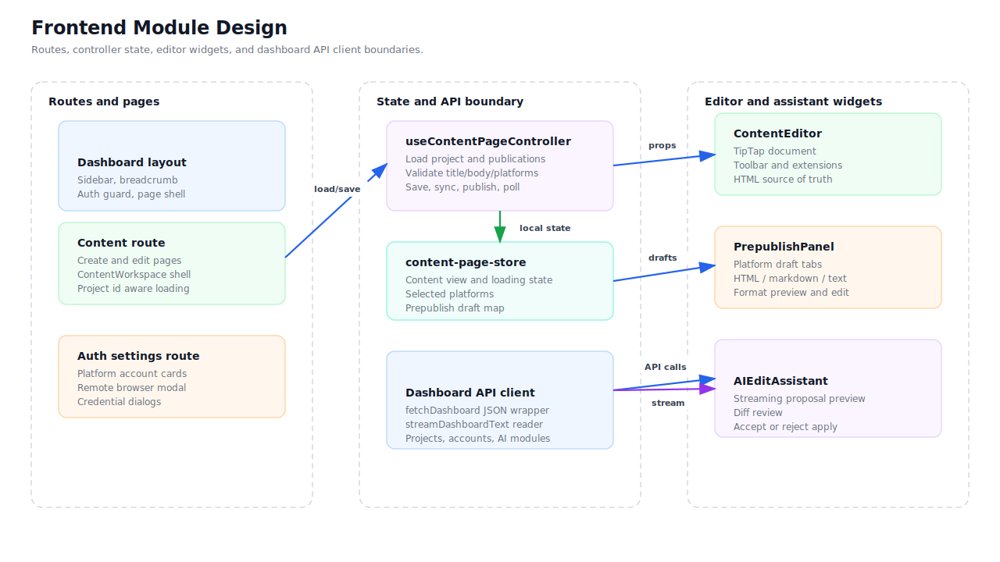
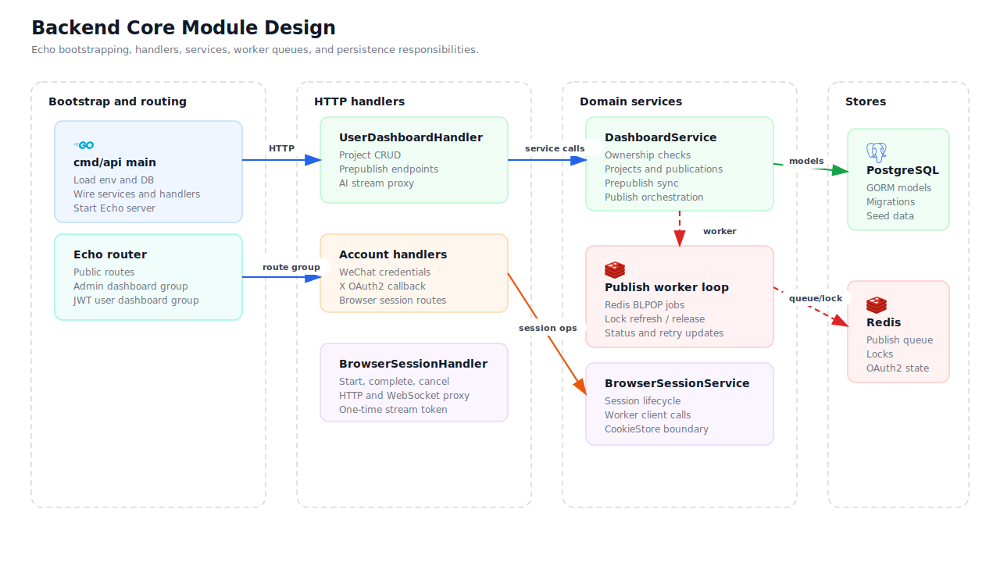
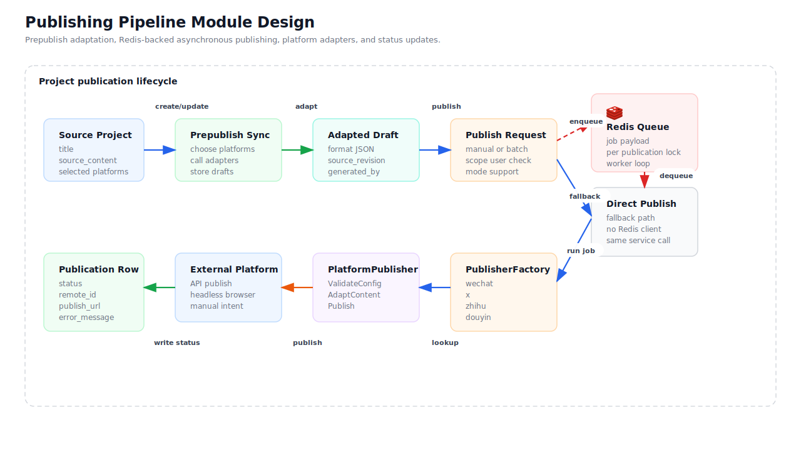
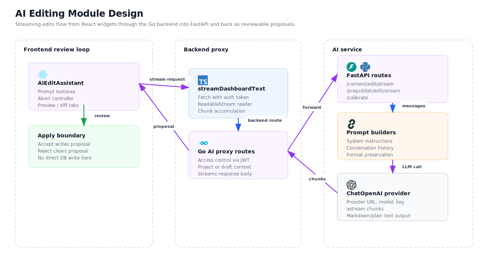
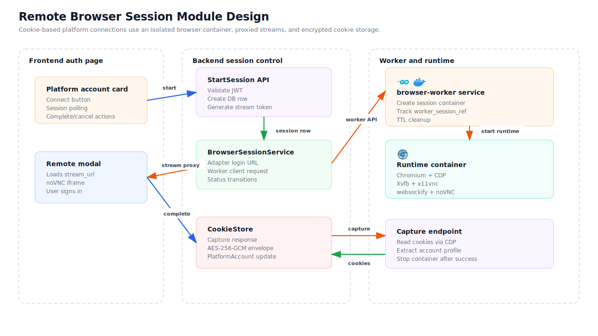
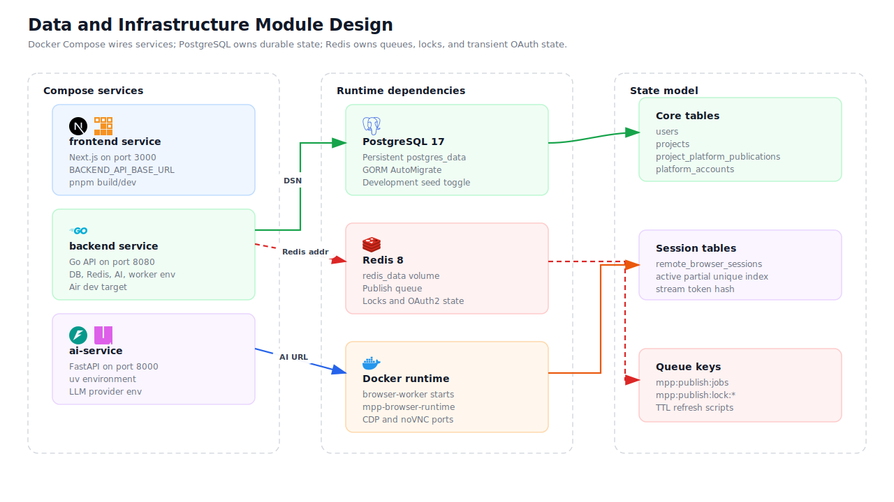

# MPP Module Design

This document expands the high-level architecture with module-level design notes. It focuses on responsibilities, boundaries, data flow, and extension rules. It intentionally avoids listing concrete source file names so the design stays stable even when the implementation layout changes.

## 1. Overall Architecture

MPP is a multi-platform publishing workspace. Its core job is to turn one source project into platform-ready drafts, execute publishing work, track status, connect platform accounts, and support AI-assisted editing from one dashboard.

The system is organized into six major module groups:

- Frontend workspace: the dashboard shell, editor experience, platform draft review, AI proposal review, and platform account connection UI.
- Backend core: authentication, user-scoped APIs, domain services, publish orchestration, queue workers, and remote browser session coordination.
- Publishing pipeline: source content adaptation, per-platform draft records, asynchronous publish jobs, platform adapters, and status updates.
- AI editing: streaming edit requests, backend proxying, prompt construction, LLM streaming, and proposal review.
- Remote browser session: isolated browser login, stream proxying, account detection, cookie capture, and platform account updates.
- Data and infrastructure: container wiring, durable PostgreSQL state, Redis queues and locks, and short-lived browser runtime containers.

## 2. Frontend Workspace

The frontend workspace turns user actions into predictable dashboard state. It does not own persistence rules or platform publishing rules. Instead, it presents workflows and communicates through a narrow dashboard API boundary.

Main responsibilities:

- Route and page shell: provide the dashboard layout, content workspace, settings views, and account connection entry points.
- Page controller state: load project data, validate required fields, manage selected platforms, save edits, sync prepublish drafts, start publishing, and poll status.
- Local page store: keep editor content, loading flags, selected platforms, and the platform draft map close to the UI.
- Editor widgets: edit source content, preview platform drafts, review AI proposals, and accept or reject generated changes.
- API client boundary: keep request formatting, response parsing, streaming readers, and authentication behavior out of visual components.

Design boundaries:

- UI components handle interaction and presentation only.
- Page-level controllers coordinate workflows and prevent editor widgets from calling each other directly.
- Frontend state is a cache of the current workflow, not the durable source of truth.
- AI output first becomes a proposal. It only modifies the page state after explicit user acceptance.
- Platform keys should remain stable and machine-readable, while display labels can evolve independently.

Key data flow:

1. A dashboard route loads project and publication data through the API boundary.
2. The controller normalizes backend responses into editor state and platform draft state.
3. The editor updates source content locally.
4. Save and sync actions send validated state to the backend.
5. Publish actions trigger backend orchestration and then read status updates.
6. AI actions stream proposals back into the review widget before the user applies them.

Extension notes:

- Add new dashboard views by keeping route-level loading and validation outside presentational widgets.
- Add new editor tools by making them consume and emit page state instead of directly calling persistence APIs.
- Add new platform UI by extending platform metadata and the draft review surface, not by changing the editor core.

## 3. Backend Core

The backend core is the business orchestration layer. It receives authenticated dashboard requests, enforces user scope, coordinates domain services, and owns the transition from user intent to persistent state.

Main responsibilities:

- Application bootstrap: load environment configuration, initialize stores, create services, connect optional dependencies, and register routes.
- HTTP handlers: bind request data, read user identity, validate basic parameters, translate domain errors into HTTP responses, and delegate business work.
- Domain services: enforce ownership checks, project rules, publication state transitions, account rules, queue behavior, and remote browser session state.
- Worker loop: consume publish jobs, refresh publish locks, execute platform publishing, and persist final status.
- Store boundary: use PostgreSQL for durable state and Redis for transient coordination.
- External clients: isolate calls to AI services, browser workers, platform APIs, and browser automation adapters.

Design boundaries:

- Handlers should not own business transitions.
- Services should not know frontend presentation details.
- Platform-specific behavior belongs behind adapter boundaries.
- Optional dependencies should degrade predictably. For example, publishing can run directly when the queue is unavailable.
- User-scoped operations must always enforce ownership before reading or mutating project data.

Key data flow:

1. A dashboard request enters the authenticated user API group.
2. The handler extracts user scope and parses request data.
3. The domain service loads the relevant project or publication record.
4. Ownership and state transition rules are checked.
5. The service either updates PostgreSQL directly or coordinates Redis-backed asynchronous work.
6. The handler returns a normalized response to the frontend.

Extension notes:

- Add new domain behavior inside services rather than in HTTP handlers.
- Add new stores through small repository or client boundaries.
- Add new external integrations through clients or adapters that can be mocked in tests.

## 4. Publishing Pipeline

The publishing pipeline converts one source project into platform-specific publication records. Each platform can have its own adapted content, configuration, status, remote ID, publish URL, and error information.

Main responsibilities:

- Source project lifecycle: keep the canonical title and source content in one project-level record.
- Prepublish sync: create or update enabled platform publication records for the selected platforms.
- Content adaptation: transform source content into platform-specific draft formats.
- Publish request handling: validate ownership, platform support, publication state, and publish mode.
- Queue-backed publishing: enqueue jobs, acquire per-publication locks, consume jobs, refresh locks, and release locks after completion.
- Adapter execution: route platform work through a publisher interface so each platform can validate config, adapt content, and publish independently.
- Status persistence: update status, retry count, error message, remote ID, publish URL, and publish time.

Design boundaries:

- The project record is the source-content container.
- The platform publication record is the platform-target container.
- Adapted content belongs to the platform publication record, not the source project.
- Redis stores only job payloads and locks, not full content, cookies, or sensitive account material.
- Publishing errors must be persisted so the frontend can show state and users can retry.

Key data flow:

1. The user selects platforms and syncs prepublish drafts.
2. The backend creates or refreshes platform publication rows.
3. Platform adapters generate adapted draft content.
4. A publish request either enqueues a job or runs direct publishing as a fallback.
5. The worker locks the publication target and calls the matching platform adapter.
6. The platform adapter returns a remote result or an error.
7. The backend writes the final publication status.

Extension notes:

- To add a platform, define its stable platform key, draft format, validation rules, and publisher adapter.
- If the platform supports API publishing, keep it inside the publisher adapter.
- If the platform requires browser login, add a remote browser adapter and reuse the cookie store boundary.
- Keep retry and failure semantics consistent across all platform adapters.

## 5. AI Editing

The AI editing module provides streaming rewrite support for source content and platform-specific drafts. It separates generation from persistence: the AI service returns a proposal, and the user decides whether that proposal should update the current workspace state.

Main responsibilities:

- Frontend review loop: collect the user prompt, keep a source snapshot, stream proposal text, preview output, show diffs, and handle accept or reject.
- Backend proxy: enforce user authentication, attach project or draft context, forward requests to the AI service, and stream the response body back to the frontend.
- AI service routes: expose content editing, prepublish draft editing, and calibration operations.
- Prompt construction: build system instructions and user messages from current content, conversation history, target platform, and desired output format.
- LLM provider boundary: call an OpenAI-compatible chat model through a single provider abstraction.

Design boundaries:

- The frontend AI widget owns review state, not durable writes.
- The backend owns authentication and context checks, not prompt engineering.
- The AI service owns prompt construction and model invocation, not database access.
- The LLM should return replacement-ready content without explanations or markdown fences unless the target format requires markdown.
- Stream cancellation must be treated as a normal user action.

Key data flow:

1. The user enters an edit instruction.
2. The frontend sends a streaming request with the current content snapshot.
3. The backend validates the request and proxies it to the AI service.
4. The AI service builds messages and starts a streaming model call.
5. Chunks are streamed back through the backend to the frontend.
6. The frontend accumulates chunks into a proposal.
7. The user accepts the proposal, rejects it, or stops generation.

Extension notes:

- Add new AI actions by defining their input context, output format, prompt builder, and review surface.
- Keep all AI outputs reviewable before they alter project or publication state.
- Keep model provider configuration outside prompt logic.

## 6. Remote Browser Session

The remote browser session module supports platforms that require cookie-based login or browser-only account connection. Users sign in inside an isolated browser container, while the system controls session lifecycle, stream access, cookie capture, and account persistence.

Main responsibilities:

- Frontend auth page: show platform account cards, start browser sessions, open the remote modal, poll session status, and complete or cancel the connection.
- Backend session control: validate the user, create a session record, generate a stream token, call the worker, proxy the stream, and update final session status.
- Worker service: create and track browser runtime containers, keep worker session references, and clean up sessions after completion or TTL expiry.
- Runtime container: run Chromium with a virtual display, remote browser stream, and CDP access for controlled capture.
- Capture endpoint: read cookies and account profile data through the controlled browser session.
- Cookie store: normalize and persist captured cookies behind a storage boundary.

Design boundaries:

- The frontend never receives raw cookies or direct CDP endpoints.
- The backend owns user authentication, stream-token validation, and account updates.
- The worker owns container and CDP details.
- The runtime container is disposable and should not share browser profiles across users or platforms.
- Cookie persistence must stay behind a dedicated boundary so publishers do not depend on raw storage shape.

Key data flow:

1. The user starts a platform connection from the account page.
2. The backend validates the request and creates a remote browser session.
3. The backend asks the worker to start an isolated browser runtime.
4. The frontend opens a proxied browser stream.
5. The user signs in on the platform website.
6. The system detects login readiness.
7. The capture path reads cookies and account profile data.
8. The cookie store updates the platform account.
9. The worker stops the runtime container after success, cancellation, or expiry.

Extension notes:

- Add a browser-based platform by defining its login URL, allowed domains, required cookies, login detection, and account extraction rules.
- Keep browser runtime concerns out of backend domain services.
- Treat session TTL and cancellation as first-class lifecycle transitions.

## 7. Data and Infrastructure

The data and infrastructure module explains how runtime services are connected and which layer owns each kind of state.

Main responsibilities:

- Compose services: run the frontend, backend, AI service, PostgreSQL, and Redis together for local or containerized environments.
- Frontend runtime: serve the dashboard and call the backend through the configured API base URL.
- Backend runtime: expose the Go API, read database and Redis configuration, call the AI service, and coordinate browser worker calls.
- AI runtime: expose editing endpoints and call the configured LLM provider.
- PostgreSQL: store durable, queryable state such as users, projects, platform publication records, platform accounts, and browser session audit rows.
- Redis: store publish jobs, publish locks, OAuth state, and other transient coordination state.
- Docker runtime: host short-lived browser containers for remote login flows.

State ownership:

- PostgreSQL is the durable source of truth.
- Redis is the transient coordination layer.
- Browser containers are disposable execution environments.
- Frontend stores are workflow caches that can be rebuilt from backend state.
- External platforms remain outside the trust boundary and must be called through adapters.

Key data flow:

1. Compose wires service dependencies and environment variables.
2. The backend connects to PostgreSQL for persistent state.
3. The backend connects to Redis for queue and lock operations.
4. The frontend calls the backend through the configured service URL.
5. The backend calls the AI service for editing workflows.
6. The browser worker creates runtime containers only when remote login is needed.

Extension notes:

- Add durable business state to PostgreSQL.
- Add short-lived coordination state to Redis.
- Keep secrets in environment or secret management, not in frontend state.
- Keep browser runtime state disposable and recoverable.

## 8. Cross-Module Rules

These rules keep the modules easy to extend:

- Route layers adapt protocols; they should not own business rules.
- Domain services own permissions, state transitions, and orchestration.
- Platform differences belong behind adapters.
- Stable business fields should be relational; platform-specific dynamic fields can be structured JSON.
- AI generation should be reviewable before persistence.
- Sensitive state should not cross into the frontend.
- Asynchronous work must write durable final status.
- Runtime containers should be short-lived and replaceable.
- Redis locks and tokens should have TTLs and ownership checks.
- New modules should define clear ownership of state before adding APIs.
