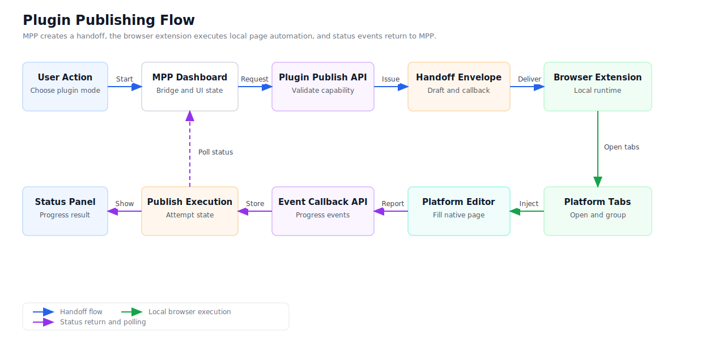

# Extension Publishing Architecture

## 1. Decision

Introduce **extension publishing** as the third publishing mode.

Extension publishing is for platforms where the native web editor is the best publishing experience, public publishing APIs are limited or unstable, and the user already has a valid local browser session. MPP prepares the platform draft, hands it to a browser extension, and the extension opens the platform editor, fills the content, uploads assets, and reports execution status back to MPP.

Publishing mode positioning:

| Mode              | Positioning                                                        |
| ----------------- | ------------------------------------------------------------------ |
| Remote publishing | Best for platforms with stable server-side publishing capability.  |
| Manual publishing | Best for intent links or flows that must be completed by the user. |
| Extension publishing | Best for local browser sessions and native platform editors.       |

## 2. Modules To Introduce

### 2.1 Browser Extension

Introduce an independent browser extension module.

Recommended choices:

| Area                | Introduce                                                  |
| ------------------- | ---------------------------------------------------------- |
| Extension framework | WXT                                                        |
| Extension standard  | Manifest V3                                                |
| Language            | TypeScript                                                 |
| React integration   | `@wxt-dev/module-react`                                    |
| Extension UI        | React + Tailwind + shadcn/ui + lucide-react                |
| Local storage       | WXT storage / `@wxt-dev/storage`                           |
| Entrypoints         | WXT file-based entrypoints                                 |
| Web page bridge     | content script + `window.postMessage`                      |
| Page injection      | runtime content scripts + `browser.scripting.executeScript` |
| Permission strategy | explicit platform hosts + `activeTab`                      |

WXT coverage:

| Need | WXT coverage |
| ---- | ------------ |
| MV3 background runtime | `entrypoints/background.ts` |
| Dashboard bridge | `entrypoints/content.ts` |
| React extension pages | `@wxt-dev/module-react` + HTML page entrypoints |
| Platform adapter injection | runtime `*.content.ts` entrypoints + `browser.scripting.executeScript` |
| Trusted origins and handoff cache | WXT storage |
| Build and packaging | WXT build and zip commands |

Extension responsibilities:

- Receive extension publishing handoff data from MPP.
- Open target platform publishing pages.
- Run bundled platform adapters.
- Fill title, body, images, videos, tags, and platform settings.
- Report progress and final results.

Extension boundaries:

- Do not execute arbitrary scripts from the backend.
- Do not upload platform cookies to MPP.
- Do not treat platform pages as trusted contexts.
- Do not auto-click the final publish button by default.

### 2.2 Extension Bridge

Introduce `extensionBridge` in the web app.

It handles:

- Extension detection.
- Trusted-origin request.
- Handoff delivery.
- Extension response handling.
- Timeout, rejection, and version mismatch handling.

Page-level UI should call `extensionBridge` instead of touching extension APIs directly.

### 2.3 Platform Capability Registry

Introduce a platform capability registry to describe publishing support consistently.

Fields:

| Field                  | Meaning                                                  |
| ---------------------- | -------------------------------------------------------- |
| `platform`             | MPP platform key.                                        |
| `supported_modes`      | Supported modes: `remote`, `manual`, `extension`.           |
| `preferred_mode`       | Recommended default mode.                                |
| `adapter_key`          | Browser extension adapter key.                           |
| `inject_url`           | Page opened by extension publishing.                        |
| `content_kinds`        | Article, dynamic post, image note, video, etc.           |
| `target_formats`       | Supported draft formats, such as html, markdown, text.   |
| `requires_review`      | Whether user review is required before final submission. |
| `auto_publish_allowed` | Whether the adapter may click publish automatically.     |

Example:

```text
platform: zhihu
supported_modes: extension, remote
preferred_mode: extension
adapter_key: ARTICLE_ZHIHU
inject_url: https://zhuanlan.zhihu.com/write
content_kinds: article
target_formats: markdown, html
requires_review: true
auto_publish_allowed: false
```

### 2.4 Handoff Protocol

Introduce a versioned `handoff` protocol.

```json
{
  "schema_version": 1,
  "type": "mpp.extension_publish_handoff",
  "execution_id": "uuid",
  "expires_at": "2026-06-02T10:10:00Z",
  "project": {
    "id": "uuid",
    "title": "Post title"
  },
  "platforms": [
    {
      "platform": "zhihu",
      "adapter_key": "ARTICLE_ZHIHU",
      "inject_url": "https://zhuanlan.zhihu.com/write",
      "content_kind": "article",
      "auto_publish": false,
      "requires_review": true,
      "adapted_content": {
        "schema_version": 1,
        "format": "markdown",
        "markdown": "Draft body"
      },
      "assets": [
        {
          "type": "image",
          "source_url": "https://example.com/a.jpg",
          "name": "a.jpg",
          "mime_type": "image/jpeg"
        }
      ],
      "callback": {
        "url": "https://mpp.example.com/api/extension-publish/executions/uuid/events",
        "token": "one-time-token"
      }
    }
  ]
}
```

Rules:

- Include schema version and expiration time.
- Use a short-lived one-time callback token.
- Send content, assets, and execution parameters only.
- Do not send platform cookies.
- Do not send MPP login tokens.
- Do not send executable scripts.

### 2.5 Publish Execution Model

Introduce `publish_execution` to track one extension publishing run.

Records:

| Record                  | Purpose                                   |
| ----------------------- | ----------------------------------------- |
| Publish execution       | Overall state of a extension publishing run. |
| Platform execution item | State of each platform tab.               |
| Execution event         | Progress log reported by the extension.   |

Execution statuses:

| Status           | Meaning                                      |
| ---------------- | -------------------------------------------- |
| `handoff_issued` | Handoff has been created.                    |
| `accepted`       | Extension accepted the handoff.              |
| `opening_tabs`   | Extension is opening platform pages.         |
| `injecting`      | Extension is injecting platform adapters.    |
| `user_review`    | Draft is filled and waiting for user review. |
| `submitted`      | Platform submission has been triggered.      |
| `succeeded`      | Publishing succeeded.                        |
| `failed`         | Publishing failed.                           |
| `cancelled`      | User cancelled the flow.                     |
| `expired`        | Handoff expired.                             |

### 2.6 Extension Event Callback

Introduce the extension event callback:

```http
POST /api/extension-publish/executions/:id/events
```

Event shape:

```json
{
  "token": "one-time-token",
  "event_id": "uuid",
  "platform": "zhihu",
  "status": "user_review",
  "message": "Draft filled. Waiting for user review.",
  "remote_id": "",
  "publish_url": "",
  "error_message": "",
  "metadata": {
    "tab_id": 123,
    "url": "https://zhuanlan.zhihu.com/write"
  }
}
```

Callback rules:

- `token` is short-lived.
- `event_id` is idempotent.
- Events can update only the current execution.
- Errors are sanitized before user display.
- A platform publication is marked successful only after confirmed submission success.

## 3. Publishing Flow



Flow:

1. The user syncs pre-publish drafts.
2. The user selects extension publishing.
3. The service validates platform capability and creates a publish execution.
4. The service returns a `handoff`.
5. The dashboard sends the `handoff` to the browser extension.
6. The extension validates origin, schema version, expiration time, and adapter key.
7. The extension opens the platform page and injects the platform adapter.
8. The adapter fills content and assets.
9. The extension reports execution events.
10. The dashboard displays progress, failures, and next actions.

## 4. Extension Structure

```text
extension/
  wxt.config.ts
  entrypoints/
    background.ts
    content.ts
    publish/
      index.html
      main.tsx
    trust-origin/
      index.html
      main.tsx
    zhihu-article.content.ts
    douyin-dynamic.content.ts
    xiaohongshu-note.content.ts
    bilibili-dynamic.content.ts
  src/
    background/handoff.ts
    background/tabs.ts
    background/callback.ts
    adapters/zhihu-article.ts
    adapters/douyin-dynamic.ts
    adapters/xiaohongshu-note.ts
    adapters/bilibili-dynamic.ts
    account/detectors.ts
    types/handoff.ts
    types/events.ts
```

Module responsibilities:

| Module | Responsibility |
| ------ | -------------- |
| `entrypoints/content.ts` | Safe bridge between the page and extension background. |
| `entrypoints/background.ts` | Runtime message router and lifecycle entrypoint. |
| `entrypoints/*.content.ts` | Runtime content-script entrypoints for platform injection. |
| `entrypoints/publish/*` | Show progress, failures, and retry actions. |
| `entrypoints/trust-origin/*` | Let the user approve trusted MPP origins. |
| `src/background/handoff.ts` | Validate and store the current handoff. |
| `src/background/tabs.ts` | Create, group, reload, and close platform tabs. |
| `src/background/callback.ts` | Send execution events back to MPP. |
| `src/adapters/*` | Platform-specific DOM publishing logic imported by runtime content scripts. |
| `src/account/detectors.ts` | Detect whether the user is signed in on a platform. |

## 5. Platform Adapter Rules

- One adapter per platform flow.
- Validate draft format before filling the page.
- Only operate on the matching platform page.
- Convert remote assets to `Blob` / `File` before upload.
- Prefer paste events for rich text editors.
- Return `user_review` instead of `succeeded` when success cannot be detected reliably.

Adapter outputs:

| Output        | Meaning                                                 |
| ------------- | ------------------------------------------------------- |
| `user_review` | Content is filled; user should review or click publish. |
| `succeeded`   | Publishing success is confirmed.                        |
| `failed`      | Adapter failed or the platform page is unavailable.     |

## 6. Permission Strategy

Recommended permissions:

```json
{
  "permissions": ["activeTab", "tabs", "scripting", "storage", "sidePanel"],
  "host_permissions": [
    "https://mpp.example.com/*",
    "http://localhost/*",
    "http://127.0.0.1/*",
    "https://zhuanlan.zhihu.com/*",
    "https://www.zhihu.com/*",
    "https://creator.xiaohongshu.com/*",
    "https://creator.douyin.com/*",
    "https://t.bilibili.com/*",
    "https://member.bilibili.com/*"
  ]
}
```

Principles:

- Do not request `cookies` permission in the MVP.
- Do not request broad all-site permissions in the MVP.
- Add explicit platform domains for each supported platform.
- Open pages and inject scripts only after a user-triggered publish action.

## 7. First Platforms

Prioritize:

| Platform         | Content Type | Reason                                                         |
| ---------------- | ------------ | -------------------------------------------------------------- |
| Zhihu            | Article      | Good first flow: fill draft, then require user review.         |
| Xiaohongshu      | Image note   | Local sign-in and native upload UX matter.                     |
| Douyin           | Image/video  | Native creator tooling is stronger than background automation. |
| Bilibili Dynamic | Dynamic post | DOM publishing is the more direct path.                        |

Defer:

| Platform                | Reason                                                                                                   |
| ----------------------- | -------------------------------------------------------------------------------------------------------- |
| X                       | Manual intent and remote publishing are already simple enough.                                           |
| WeChat Official Account | Prefer official capability first; extension can be a fallback for editor refinement or missing permissions. |

## 8. Web App UX

Add publishing mode choices:

| Choice            | Behavior                                |
| ----------------- | --------------------------------------- |
| Recommended       | Use platform capability preference.     |
| Remote publishing | Use server-side publishing.             |
| Extension publishing | Trigger the browser extension.          |
| Manual publishing | Create an intent link or copyable link. |

Extension states:

| State              | UI                                             |
| ------------------ | ---------------------------------------------- |
| Extension missing  | Show install entry and fallback modes.         |
| Origin untrusted   | Ask the user to trust the current MPP origin.  |
| Draft unsynced     | Ask the user to sync pre-publish drafts first. |
| Extension accepted | Show that platform pages are opening.          |
| User review        | Ask the user to review the platform tab.       |
| Failed             | Show error and retry entry.                    |
| Succeeded          | Show success state and platform link.          |

## 9. Security Boundaries

- The backend sends data, not scripts.
- The extension trusts only user-approved MPP origins.
- Callback tokens are short-lived.
- Callback events are idempotent.
- Platform pages cannot access MPP login tokens.
- Extension publishing does not upload platform cookies.
- Auto-publish is disabled by default.
- When success cannot be verified, return `user_review`.

## 10. MVP Order

1. Add the platform capability registry.
2. Support `mode=extension` in publishing requests.
3. Add the `handoff` protocol.
4. Add publish execution records and event callbacks.
5. Create the WXT browser extension module.
6. Implement the page bridge, trusted-origin approval, publish monitor, and tab manager.
7. Implement the Zhihu article adapter first with `auto_publish=false`.
8. Add Xiaohongshu image note, Douyin image/video, and Bilibili Dynamic.
9. Add extension version checks, execution history, callback rate limits, and adapter regression tests.

## 11. Final Direction

Extension publishing turns native platform editors into part of the MPP publishing pipeline.

MPP owns content management, platform draft adaptation, status tracking, and failure tracing. The browser extension owns local page execution. This preserves a unified workspace while using the user's local browser session and the platform's native publishing experience.
