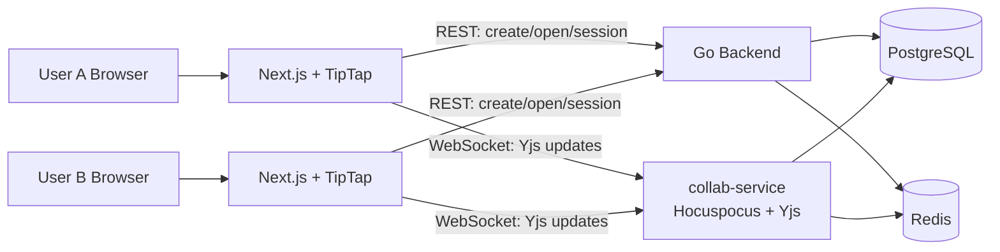
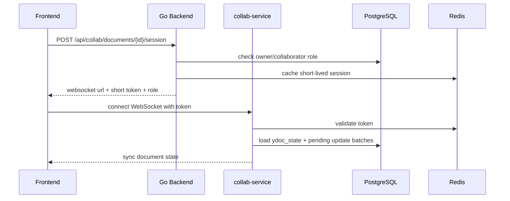
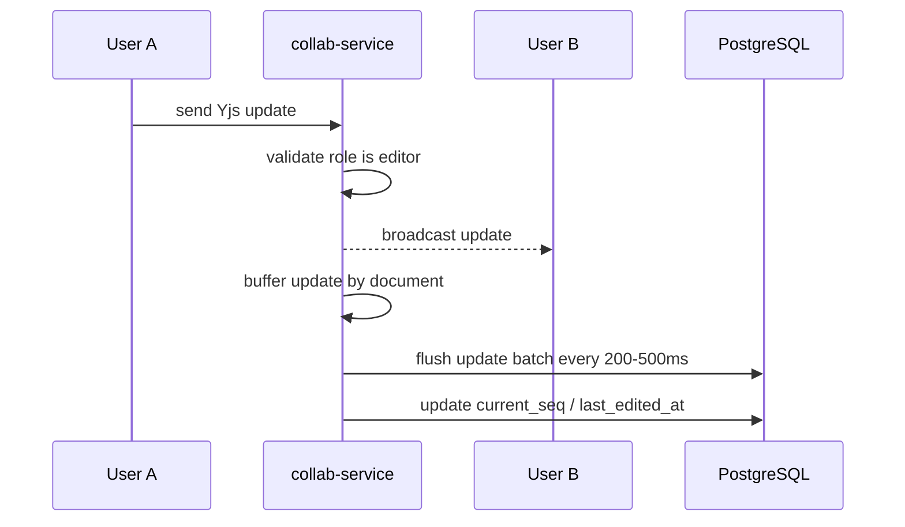
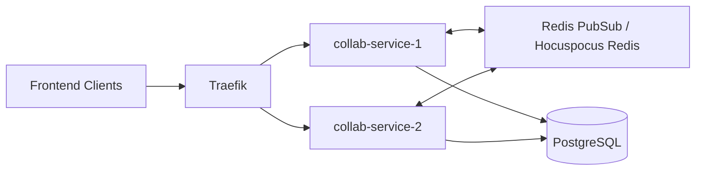

# MPP Collaborative Editing MVP Technical Architecture Plan

## 1. Current Goal

At this stage, the focus is on a single task: enabling real-time collaborative editing of the same content within MPP.

This version is not intended to be a complete suite like Notion, Feishu/Lark Docs, or Google Docs. It will not include comments, complex permissions, version history, search, attachment libraries, approval flows, database views, or knowledge bases. The architecture will only retain the essential capabilities for collaborative editing while maintaining clear boundaries for future extensions.

## 2. Scope for This Phase

| Capability | Included | Description |
| --- | --- | --- |
| Multi-user Real-time Editing | Yes | Multiple users editing the same document simultaneously with real-time synchronization. |
| Auto-save | Yes | Automatic persistence of edited content; survives refreshes and restarts. |
| Presence/Cursor | Lightweight | Displaying collaborator status, cursors, and selections (non-persistent). |
| Doc Creation/Opening | Minimal | Ability to create, open, and read document titles. |
| Editing Permissions | Minimal | `editor` (can edit), `viewer` (read-only). |
| Distributed Scalability | Architectural Reserve | P0 for single instance, P1 for horizontal scaling. |
| Integration with Publishing | Delayed | Syncing collaborative docs to MPP Projects in the future. |
| Comments/Mentions/Notif | Delayed | Won't affect the core collaborative editing foundation. |
| Version History | Basic Snapshots | Technical snapshots for recovery only; no user-facing version panel. |
| Full-text Search | Delayed | Focused on editing availability first. |
| Attachments/Assets | Delayed | Integration with object storage later. |
| Notion Database | No | Part of future product capabilities. |

## 3. Recommended General Architecture

Continue using the existing TipTap frontend and add an independent collaboration service:

- `frontend`: TipTap + Yjs client, responsible for Editor UI and WebSocket connections.
- `backend`: Go API, responsible for authentication, document metadata, collaborator permissions, and issuing collaboration session tokens.
- `collab-service`: New Node.js/TypeScript service using Hocuspocus + Yjs, responsible for real-time collaboration, broadcasting, presence, and persistence.
- `PostgreSQL`: Stores document metadata, Yjs states, and incremental update logs.
- `Redis`: Stores temporary presence, multi-instance broadcasting, short-term token cache, and rate limiting.



## 4. Design Rationale

### 4.1 Why Not Put WebSockets in the Go Backend?

The Go backend is currently better suited for business APIs: authentication, permissions, publishing orchestration, account, and project management. Collaborative editing has different runtime characteristics:

- High number of long-lived connections.
- High message frequency.
- Handling of Yjs binary updates.
- Requirement for presence and cross-instance broadcasting.
- Independent rate limiting and scaling needs.

Building a separate `collab-service` prevents real-time editing from overloading general APIs and simplifies future horizontal scaling.

### 4.2 Why Stick with TipTap + Yjs?

The frontend already depends on TipTap. Sticking with it is most cost-effective. Yjs is excellent for real-time collaboration and offline conflict resolution. Hocuspocus is a straightforward self-hosted solution within the Yjs/TipTap ecosystem.

### 4.3 PostgreSQL as the Source of Truth, Redis for Temporary Coordination

Collaborative data cannot reside solely in Redis. While Redis is great for presence, tokens, pubsub, and rate limiting, the recoverable document state must be persisted in PostgreSQL.

## 5. Minimal Data Model

Avoid complex models like workspaces, teams, organizations, or comments for now. Only add tables required for collaborative editing.

### 5.1 Documents Table

```sql
CREATE TABLE collab_documents (
  id uuid PRIMARY KEY,
  owner_user_id uuid NOT NULL REFERENCES users(id),
  title text NOT NULL,
  status text NOT NULL DEFAULT 'active',
  schema_version int NOT NULL DEFAULT 1,
  current_seq bigint NOT NULL DEFAULT 0,
  last_edited_by uuid REFERENCES users(id),
  last_edited_at timestamptz,
  created_at timestamptz NOT NULL DEFAULT now(),
  updated_at timestamptz NOT NULL DEFAULT now(),
  deleted_at timestamptz
);

CREATE INDEX idx_collab_documents_owner_updated
  ON collab_documents(owner_user_id, updated_at DESC);
```

**Notes:**
- Documents are currently organized by owner.
- Add `workspace_id` or migrate to a workspace model later when team spaces are needed.
- `schema_version` is for future editor schema migrations.
- `current_seq` is the server-side sequence number for Yjs updates.

### 5.2 Collaborators Table

```sql
CREATE TABLE collab_document_collaborators (
  document_id uuid NOT NULL REFERENCES collab_documents(id) ON DELETE CASCADE,
  user_id uuid NOT NULL REFERENCES users(id) ON DELETE CASCADE,
  role text NOT NULL CHECK (role IN ('editor', 'viewer')),
  created_by uuid NOT NULL REFERENCES users(id),
  created_at timestamptz NOT NULL DEFAULT now(),
  PRIMARY KEY (document_id, user_id)
);

CREATE INDEX idx_collab_document_collaborators_user
  ON collab_document_collaborators(user_id, role);
```

**Roles:**
| Role | Capability |
| --- | --- |
| editor | Can edit content, see others' cursors. |
| viewer | Read-only, see others' cursors, cannot send edit updates. |

Owners have `editor` permissions by default and don't necessarily need an entry in the collaborators table.

### 5.3 Document State Table

```sql
CREATE TABLE collab_document_states (
  document_id uuid PRIMARY KEY REFERENCES collab_documents(id) ON DELETE CASCADE,
  ydoc_state bytea NOT NULL,
  state_vector bytea,
  compacted_until_seq bigint NOT NULL DEFAULT 0,
  state_size_bytes int NOT NULL DEFAULT 0,
  updated_at timestamptz NOT NULL DEFAULT now()
);
```

**Notes:**
- `ydoc_state` is the current compressed Yjs document state.
- `collab-service` prioritizes loading this state when a new user opens a document.
- Do not store only HTML/Markdown; otherwise, the full collaborative state cannot be restored.

### 5.4 Update Batches Table

```sql
CREATE TABLE collab_document_update_batches (
  id bigserial PRIMARY KEY,
  document_id uuid NOT NULL REFERENCES collab_documents(id) ON DELETE CASCADE,
  from_seq bigint NOT NULL,
  to_seq bigint NOT NULL,
  update_payload bytea NOT NULL,
  update_count int NOT NULL,
  payload_size_bytes int NOT NULL,
  actor_user_id uuid REFERENCES users(id),
  created_at timestamptz NOT NULL DEFAULT now(),
  UNIQUE(document_id, from_seq, to_seq)
);

CREATE INDEX idx_collab_update_batches_doc_seq
  ON collab_document_update_batches(document_id, to_seq DESC);
```

**Why Update Batches?**
- Prevents data loss if the service crashes (avoiding reliance solely on debounced full-doc saves).
- Supports recovery from the latest snapshot plus incremental updates.
- Enables future version history, auditing, and syncing to publishing projects.

## 6. Collaboration Workflow

### 6.1 Opening a Document



### 6.2 Edit Synchronization



### 6.3 Snapshot Compaction

Executed periodically by `collab-service` or a worker:
1. Read current `ydoc_state`.
2. Apply uncompressed update batches.
3. Generate new `ydoc_state` and `state_vector`.
4. Update `compacted_until_seq`.
5. Retain update batches for 7-30 days (cleanup older ones later).

**Trigger Conditions:**
| Condition | Suggested Value |
| --- | --- |
| Update Batch Count | Every 100 batches |
| Time Interval | Every 5 minutes |
| Incremental Size | Over 1 MB |
| Doc Closure | One delayed compaction within 30s |

## 7. API Design

Only a few APIs are needed initially.

| API | Description |
| --- | --- |
| `POST /api/collab/documents` | Create collaborative document |
| `GET /api/collab/documents` | List my collaborative documents |
| `GET /api/collab/documents/{id}` | Get document metadata |
| `PATCH /api/collab/documents/{id}` | Update title |
| `POST /api/collab/documents/{id}/collaborators` | Add collaborator |
| `DELETE /api/collab/documents/{id}/collaborators/{userId}` | Remove collaborator |
| `POST /api/collab/documents/{id}/session` | Issue collab session token |
| `GET /collab/documents/{id}` | WebSocket collaboration channel |

**Session Response Example:**
```json
{
  "document_id": "uuid",
  "role": "editor",
  "websocket_url": "ws://localhost:8090/collab/documents/{id}",
  "token": "short-lived-token",
  "expires_at": "2026-06-03T12:00:00Z",
  "limits": {
    "max_message_bytes": 524288,
    "heartbeat_seconds": 30
  }
}
```

## 8. collab-service Design

### 8.1 Responsibilities
`collab-service` focuses exclusively on collaboration:
- Validating short-lived session tokens.
- Loading Yjs document state.
- Receiving Yjs updates.
- Broadcasting to online users in the same document.
- Handling awareness/presence.
- Batch persisting updates.
- Periodic snapshot compaction.
- Exposing metrics, health, and readiness.

**Exclusions:**
- Login/Registration.
- Long-term permission management.
- Publishing platform adapters.
- AI editing.
- Comments, notifications, search.

### 8.2 Recommended Directory Structure
```text
collab-service/
  package.json
  Dockerfile
  src/
    server.ts
    auth.ts
    config.ts
    persistence/postgres.ts
    presence/redis.ts
    metrics.ts
    logger.ts
```

### 8.3 Key Configuration

| Env Var | Description | Default Value |
| --- | --- | --- |
| `COLLAB_PORT` | Service port | `8090` |
| `DATABASE_URL` | PostgreSQL connection | Required |
| `REDIS_ADDR` | Redis address | `redis:6379` |
| `BACKEND_INTERNAL_URL` | Backend internal address | `http://backend:8080` |
| `COLLAB_TOKEN_PUBLIC_KEY` | Token signature public key | Required |
| `COLLAB_UPDATE_FLUSH_MS` | Update flush interval | `300` |
| `COLLAB_UPDATE_FLUSH_MAX_COUNT` | Max updates per batch | `32` |
| `COLLAB_MAX_MESSAGE_BYTES` | Single message size limit | `524288` |
| `COLLAB_MAX_DOC_CONNECTIONS` | Max connections per doc | `100` |
| `COLLAB_HEARTBEAT_SECONDS` | Heartbeat interval | `30` |

## 9. Distribution and Performance

### 9.1 P0: Single Instance
Start with a single instance:
- Simple implementation.
- Easier verification of data consistency.
- Sufficient for early testing and internal use.
- PostgreSQL already stores recoverable states.

P0 isn't "unscalable"; it's about getting the protocol, data, and recovery right first.

### 9.2 P1: Multi-instance
Scale as connection counts grow:



**Requirements:**
- Traefik supporting WebSocket upgrades.
- Sticky sessions to keep users on the same instance when possible.
- Redis pub/sub or Hocuspocus Redis extension for sync.
- Future: Consistency routing by document ID.

### 9.3 P2: Document Sharding
When a single instance cannot handle all active documents:
- Route via `hash(document_id) % shard_count`.
- Shards can have primary-secondary setups.
- Hot documents can migrate shards independently.

### 9.4 Suggested Performance Parameters
| Item | Suggested Value |
| --- | --- |
| Concurrent Editors per Doc | P0: 20, P1: 100 |
| Connections per User | 5-10 |
| Single Update Size | 512 KB Limit |
| Update Flush Interval | 200-500 ms |
| Update Batch Count | 16-32 updates |
| WebSocket Heartbeat | 30s |
| Doc Open p95 | < 800 ms for small docs |
| Broadcast p95 (same region) | < 150 ms |
| Persistence p99 | < 2s |

## 10. Integration Path

### 10.1 Frontend
Additions:
```text
frontend/src/features/collab-editor/
  collab-editor.tsx
  use-collab-document.ts
  collab-provider.ts
  toolbar.tsx
```
**Responsibilities:**
- Call backend to create/open docs.
- Request collab sessions.
- Initialize Y.Doc and TipTap editor.
- Connect to `collab-service`.
- Show status: connecting, synced, offline, readonly.

### 10.2 Backend
Additions:
```text
backend/internal/services/collabdoc/
backend/internal/handlers/collab_doc.go
backend/internal/models/collab.go
```
**Responsibilities:**
- Document creation and collaborator management.
- Permission validation (editor/viewer).
- Issuing short-lived tokens.
- Providing APIs for doc list and title updates.

### 10.3 Docker
New `collab-service`:
```yaml
collab-service:
  build:
    context: ../collab-service
    dockerfile: Dockerfile
  env_file: .env
  environment:
    COLLAB_PORT: "8090"
    DATABASE_URL: ${DATABASE_URL}
    REDIS_ADDR: ${REDIS_ADDR:-redis:6379}
    BACKEND_INTERNAL_URL: http://backend:8080
  depends_on:
    db:
      condition: service_healthy
    redis:
      condition: service_healthy
```
Traefik adds `/collab` WebSocket routing.

## 11. Security Boundaries

**Mandatory:**
- WebSockets require short-lived backend tokens.
- Tokens must contain `user_id`, `document_id`, `role`, `exp`.
- `collab-service` must reject content updates from `viewer` roles.
- WebSocket Origin validation.
- Rate limiting for connections per user/doc.
- Logs must not print content or Yjs update binaries.

**Delayed:**
- Block-level permissions.
- Public sharing links.
- Document watermarks.
- E2E encryption.

## 12. Monitoring Metrics

| Metric | Description |
| --- | --- |
| `collab_ws_connections` | Current connection count |
| `collab_active_documents` | Number of active documents |
| `collab_update_bytes_total` | Total update bytes |
| `collab_update_flush_duration_seconds` | DB write latency for batches |
| `collab_document_load_duration_seconds` | Document load latency |
| `collab_broadcast_duration_seconds` | Broadcast latency |
| `collab_auth_denied_total` | Number of failed authentications |
| `collab_snapshot_duration_seconds` | Compaction latency |

**Log Fields:**
- `trace_id`, `document_id`, `user_id`, `role`, `connection_id`, `event`, `duration_ms`, `error_code`.

## 13. Testing and Acceptance

### 13.1 Scenarios
| Scenario | Acceptance Criteria |
| --- | --- |
| Dual-user Simultaneous Edit | Eventual consistency on both ends. |
| Concurrent Input at Same Pos | No character loss or overwrites. |
| Page Refresh | Content persists. |
| collab-service Restart | Documents are recoverable. |
| Viewer Opens Doc | Readable, not editable. |
| Token Expiration | Connection rejected; session re-fetch required. |
| Redis Unavailable | P0 single instance degrades (no presence), but persists content. |
| PostgreSQL Transient Failure | Stop confirmation; frontend shows offline/save failed. |

### 13.2 Load Test Targets
- 20 users editing the same document.
- 100 users opening 20 different documents.
- 30 minutes of continuous editing without data loss.
- Service recovery under 30s after restart.

## 14. Implementation Roadmap

### Phase 1: Minimal Collab Link
- **Deliverables:** `collab_documents`, `collab_document_collaborators` tables. Backend APIs for creation/session. `collab-service` supporting single-doc Yjs WebSocket. Frontend collab editor.
- **Acceptance:** Two browsers editing the same doc and syncing.

### Phase 2: Reliable Persistence
- **Deliverables:** `collab_document_states`, `collab_document_update_batches`. Flush logic. Snapshot compaction. Recovery after restart.
- **Acceptance:** No loss after refresh or service restart. Data visible in PG.

### Phase 3: Permissions and Experience
- **Deliverables:** Editor/Viewer roles. Read-only mode. Presence/Cursor. Status UI. Rate limiting.
- **Acceptance:** Viewers cannot edit. Cursors visible. Offline state detectable.

### Phase 4: Distributed Readiness
- **Deliverables:** Redis presence. Redis pub/sub research. Traefik routing. Prometheus metrics. Multi-instance local validation.
- **Acceptance:** Sync works across two `collab-service` instances. Metrics visible.

## 15. Future Expansion Order
1. Sync docs to MPP Project for multi-platform publishing.
2. User-visible version history.
3. Comments and mentions.
4. Image/Attachment object storage.
5. Document search.
6. Full workspace/team model.
7. AI-assisted editing.
8. Notion-like database.

## 16. References
- [Yjs Document Updates](https://docs.yjs.dev/api/document-updates)
- [Yjs Awareness](https://docs.yjs.dev/getting-started/adding-awareness)
- [Hocuspocus Documentation](https://tiptap.dev/docs/hocuspocus/introduction)
- [TipTap Collaboration Extension](https://tiptap.dev/docs/editor/extensions/functionality/collaboration)
- [Redis Pub/Sub](https://redis.io/docs/latest/develop/pubsub/)
