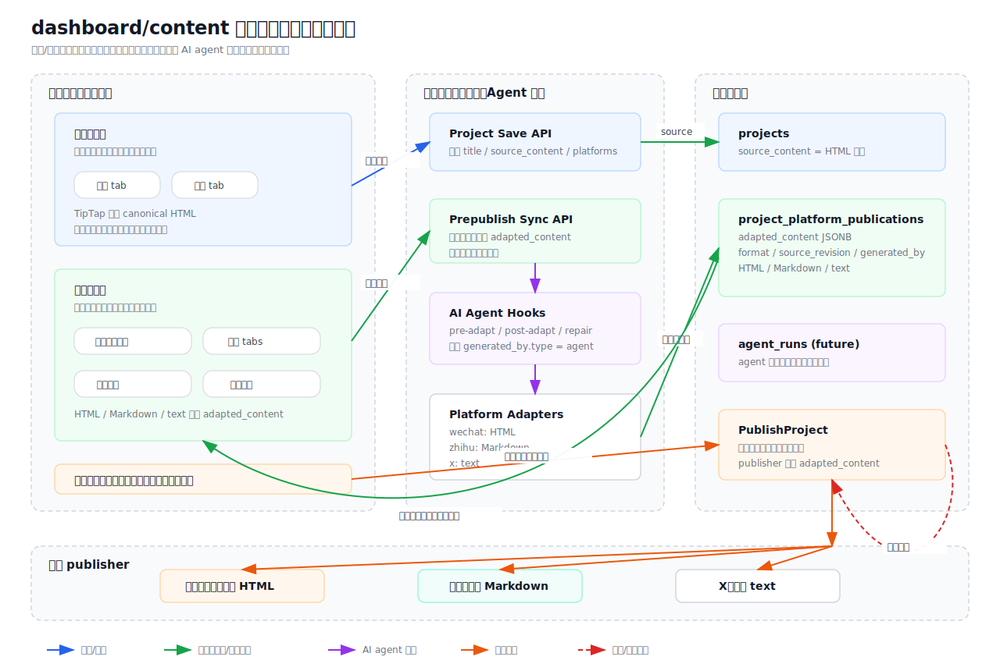

# Platform Draft Multi-Format Adaptation Plan

## 1. Background

The current project already has a basic model of "one project, multi-platform publish records":

- `projects.source_content` saves the project's source draft.
- `project_platform_publications.adapted_content` saves the adapted content for specific platforms.
- `ProjectPlatformPublication` uses `(project_id, platform)` to uniquely identify the publication target of the same project across different platforms.

This model is suitable for supporting multi-format drafts, but the current implementation does not strictly separate the "source draft format" and "platform target format". The frontend editor saves HTML; the WeChat Official Account publishing path treats it as HTML; the Zhihu adaptation field name is `markdown`, but currently it just puts the source HTML in as-is, and the publishing logic doesn't even read the real `adapted_content`.

The target requirements are:

- WeChat Official Account drafts use HTML.
- Zhihu drafts use Markdown.
- Future platforms can still be extended to formats like plain text, image notes, video feeds, etc.
- `dashboard/content` no longer uses a two-column layout with editor on the left and preview on the right. Instead, it merges editing and previewing into the same workspace, switched via tabs.
- Add a "Pre-publish" section to the page. After the user clicks the sync button, the system converts the current editor content into data formats for each platform and persists them.
- The pre-publish section can view both the platform's original format (e.g., HTML, Markdown, text) and the preview result of that format.
- The pre-publish pipeline needs to leave stable extension points for future AI agent intervention.



## 2. Current Status Assessment

### 2.1 Existing Capabilities

- `Project.SourceContent` can act as the source draft saving field.
- `ProjectPlatformPublication.AdaptedContent` can save derived drafts per platform.
- `CreateProject` and `UpdateProject` already call platform `AdaptContent` through `buildPublicationPayload`.
- WeChat Official Account `AdaptContent` currently outputs `{ "format": "html", "html": ... }`, and publishing will read HTML and process body images.
- X publishing already has logic to convert HTML to plain text, which can be used as a reference for "platform derived drafts only save the final published form".

### 2.2 Main Gaps

- The source draft format is not explicitly marked. The system defaults to treating `source_content` as HTML, but the field name does not reflect this.
- Zhihu `AdaptContent` does not convert HTML to Markdown.
- Zhihu `AdaptContent` uses string concatenation for JSON. There is a risk of breaking JSON when the body contains quotes, backslashes, or line breaks.
- Zhihu `Publish` currently hardcodes the title, body, and local images. It does not use the project title or `pub.AdaptedContent`.
- The frontend "Zhihu Preview" still renders HTML, not a Markdown view.
- `GetProjectPublications` filters `adapted_content` for summaries, returning only `summary` and `format`, which is not suitable for editing or debugging platform drafts.

## 3. Design Goals

### 3.1 Functional Goals

- Save one canonical source draft and generate a derived draft for each enabled platform.
- WeChat Official Account derived drafts must be HTML.
- Zhihu derived drafts must be Markdown.
- Publishers only consume their own platform's derived drafts and no longer guess or redo major format conversions.
- Platform derived drafts can be regenerated, previewed, published, and debugged.

### 3.2 Engineering Goals

- Do not mix multiple formats inside `Project.SourceContent`.
- Do not repeat format conversion rules required for backend publishing in the frontend.
- Centralize each platform's adaptation rules within the platform adapter or publisher package.
- Keep JSONB fields structured, versionable, and backfillable.
- Increase test coverage to prevent platform formats from regressing to "looks like it can be saved, but actually cannot be published".

### 3.3 Non-Goals

- Do not implement multi-user collaborative editing in the first phase.
- Do not implement bidirectional lossless rich text conversion in the first phase.
- Do not require Zhihu Markdown to 100% reproduce WeChat Official Account HTML styling.
- Do not split all platform configurations into fixed database columns; retain JSONB extension space.

## 4. Overall Architecture

Adopt the architecture of "HTML Source Draft + Explicit Sync + Platform Derived Drafts":

1. `dashboard/content` top main workspace merges editing and previewing. The user switches between `Edit` / `Preview` tabs, no longer occupying a right-side preview column long-term.
2. The frontend TipTap editor outputs canonical HTML, while retaining plain text summaries for the UI.
3. `Save` only saves the project source draft and platform selections; `Sync to Pre-publish` is a separate action.
4. After the user clicks the sync button in the pre-publish section, the backend calls adapters by platform:
   - `wechat`: HTML sanitization, image pre-processing info, outputs HTML.
   - `zhihu`: HTML to Markdown, image reference mapping, outputs Markdown.
   - `x`: HTML to plain text, length truncation, outputs text.
5. The backend saves the derived drafts into `project_platform_publications.adapted_content`.
6. The pre-publish section reads and displays these derived drafts, providing two viewing modes: `Original Format` and `Preview`.
7. During publication, `PublishProject` reads the `adapted_content` of the corresponding platform and passes it to the corresponding publisher.
8. Publishers only handle platform APIs, authentication, remote media uploads, and final submissions.
9. AI agents will serve as pluggable interventions before/after adapters in the future, without directly bypassing the boundaries of source drafts, derived drafts, and publishers.

## 5. Data Model Plan

### 5.1 Maintain Existing Relational Model

No need to add a new "Draft Format Table". The existing model already expresses:

- One project: `projects`
- Multiple platform targets: `project_platform_publications`
- One derived draft per platform target: `adapted_content`

In the first phase, it's recommended to only enhance the JSON contract without changing the table structure.

### 5.2 Source Draft Field Conventions

`projects.source_content` is explicitly defined as HTML in the first phase:

```json
{
  "source_content": "<h1>Title</h1><p>Body content</p>"
}
```

Optional enhancement field:

```sql
ALTER TABLE projects
ADD COLUMN source_format text NOT NULL DEFAULT 'html';
```

Whether to add `source_format` depends on whether scenarios like Markdown original drafts, importing Word documents, or importing WeChat historical articles are expected in the future. If only the TipTap editor is used in the short term, code constant constraints are sufficient for now.

### 5.3 Platform Derived Draft JSON Contract

WeChat Official Account:

```json
{
  "schema_version": 1,
  "format": "html",
  "summary": "Summary for lists and debugging",
  "source_revision": "2026-05-30T14:30:00Z",
  "generated_by": {
    "type": "system",
    "id": "wechat-html-adapter",
    "version": "1"
  },
  "html": "<p>HTML suitable for the WeChat draft API</p>",
  "assets": [
    {
      "type": "image",
      "source_url": "https://example.com/a.png",
      "alt": "Image alt text"
    }
  ]
}
```

Zhihu:

```json
{
  "schema_version": 1,
  "format": "markdown",
  "summary": "Summary for lists and debugging",
  "source_revision": "2026-05-30T14:30:00Z",
  "generated_by": {
    "type": "system",
    "id": "zhihu-markdown-adapter",
    "version": "1"
  },
  "markdown": "## Subtitle\n\nBody content\n\n",
  "assets": [
    {
      "type": "image",
      "source_url": "https://example.com/a.png",
      "alt": "Image alt text"
    }
  ]
}
```

X:

```json
{
  "schema_version": 1,
  "format": "text",
  "summary": "Final short text",
  "source_revision": "2026-05-30T14:30:00Z",
  "generated_by": {
    "type": "system",
    "id": "x-text-adapter",
    "version": "1"
  },
  "text": "Final short text"
}
```

`generated_by` is used to leave audit space for future AI agent intervention. In the first phase, all are generated by system adapters; later, it can record:

- `type=agent`: Generated or rewritten by an AI agent.
- `type=user`: Platform draft manually rewritten by the user.
- `source_revision`: The source draft version corresponding to the generation.
- `agent_run_id`: Corresponds to an agent run record.
- `instructions`: Summary of the user intent received by the agent.

### 5.4 Status Field Conventions

Retain existing publication statuses:

- `pending`: No adapter registered or not yet adapted.
- `adapted`: Platform derived draft generated.
- `publishing`: Submitting to the remote platform.
- `published`: Accepted by the remote platform.
- `failed`: Adaptation or publishing failed.
- `disabled`: Platform not selected by the user.

Recommended supplementary conventions:

- On adaptation failure, do not update the old `adapted_content`, only write `error_message`.
- After source draft updates, the `adapted_content` of enabled platforms is marked as expired but not automatically overwritten. Re-generate after the user clicks pre-publish sync, and clear old `remote_id`, `publish_url`, `published_at`.
- When a published record is edited again, the status returns to `adapted`, and the UI prompts "Local content has changed, needs republishing."
- Before publishing, it must be confirmed that the platform derived draft has not expired; if expired, require syncing first.

## 6. Backend Module Design

### 6.1 Add Content Adaptation Boundary

It's recommended to extract format conversion from publishers into an adapter layer:

```go
type PlatformContentAdapter interface {
    Platform() string
    TargetFormat() string
    Adapt(project *models.Project, opts AdaptOptions) (AdaptedContent, error)
}
```

`AdaptedContent` uses a strongly typed structure, unified with `json.Marshal`:

```go
type AdaptedContent struct {
    SchemaVersion int             `json:"schema_version"`
    Format        string          `json:"format"`
    Summary       string          `json:"summary"`
    SourceRevision string         `json:"source_revision"`
    GeneratedBy   GeneratedBy     `json:"generated_by"`
    HTML          string          `json:"html,omitempty"`
    Markdown      string          `json:"markdown,omitempty"`
    Text          string          `json:"text,omitempty"`
    Assets        []AdaptedAsset  `json:"assets,omitempty"`
}

type GeneratedBy struct {
    Type         string `json:"type"`
    ID           string `json:"id"`
    Version      string `json:"version,omitempty"`
    AgentRunID   string `json:"agent_run_id,omitempty"`
    Instructions string `json:"instructions,omitempty"`
}
```

In the short term, no new interface files need to be added. First, refactor the existing `PlatformPublisher.AdaptContent` according to this contract; in the mid-term, extract the adapter to prevent the publisher from being responsible for both conversion and publishing.

Sync actions are recommended to land in the service layer:

```go
func (s *DashboardService) SyncProjectPrepublish(
    projectID uuid.UUID,
    userID uuid.UUID,
    platforms []string,
    actor SyncActor,
) (*dto.ProjectPublicationsResponse, error)
```

`actor` is fixed to the system in the first phase; when AI agents intervene in the future, the same entry point is reused, only changing the `actor` and the processing steps before/after the adapter.

### 6.2 WeChat Official Account Adaptation

Responsibilities:

- Receive HTML source draft.
- Retain paragraphs, headings, lists, blockquotes, images.
- Clean up tags and attributes not supported by WeChat or high-risk.
- Output `format=html`.

Publisher Responsibilities:

- Read `adapted_content.html`.
- Download, compress, upload body images.
- Replace image URLs.
- Create WeChat draft.
- If the account has no direct publishing permission, retain the draft ID and prompt manual publishing.

### 6.3 Zhihu Adaptation

Responsibilities:

- Receive HTML source draft.
- Convert to Markdown.
- Retain heading levels, paragraphs, bold, italics, links, lists, blockquotes, code blocks, images.
- Output `format=markdown`.

Recommended Implementation:

- Use a Go HTML-to-Markdown library, such as [`github.com/JohannesKaufmann/html-to-markdown/v2`](https://pkg.go.dev/github.com/JohannesKaufmann/html-to-markdown/v2). This library is available on `pkg.go.dev` and can be introduced via `go get -u github.com/JohannesKaufmann/html-to-markdown/v2`.
- Modify dependencies through the package manager, do not manually edit `go.mod` / `go.sum`.
- Add unit tests for common TipTap HTML nodes.

Publisher Responsibilities:

- Read `adapted_content.markdown`.
- Read project title or `config.title`.
- Use browser automation to enter the Zhihu writing page.
- Paste Markdown content into the editor. If necessary, downgrade to plain text pasting based on Zhihu's editor capabilities.
- Image strategy: support remote URL Markdown first; local `data:` images need to be uploaded or converted to clipboard images first.

### 6.4 X Adaptation

Responsibilities:

- Receive HTML source draft.
- Convert to plain text.
- Concatenate title and body.
- Truncate to 280 characters according to X's weighting rules.
- Output `format=text`.

Existing X logic is already close to the target, only needing to fill in `schema_version` and unify the structure.

## 7. API Design

### 7.1 Save Project

The save project API continues to use the existing interface, but its responsibility is adjusted to only save the source draft, title, and platform selections. It does not automatically overwrite platform derived drafts on every save:

```http
POST /api/user/dashboard/projects
PUT /api/user/dashboard/projects/:projectId
```

Request body still sends:

```json
{
  "title": "Title",
  "source_content": "<p>HTML source draft</p>",
  "summary": "Plain text summary",
  "cover_image_url": "https://example.com/cover.png",
  "platforms": ["wechat", "zhihu"]
}
```

Backend completes within a transaction:

- Save `projects.source_content`.
- Save user-selected platform targets.
- Disable unselected platforms.
- Mark enabled platform derived drafts as needing sync, or judge expiration via `adapted_content.source_revision`.

### 7.2 Sync to Pre-publish

New sync API:

```http
POST /api/user/dashboard/projects/:projectId/prepublish/sync
```

Request body:

```json
{
  "platforms": ["wechat", "zhihu"],
  "actor": {
    "type": "system"
  }
}
```

Response body returns the latest platform derived draft summary and necessary full content:

```json
{
  "project_id": "...",
  "items": [
    {
      "platform": "wechat",
      "status": "adapted",
      "adapted_content": {
        "schema_version": 1,
        "format": "html",
        "summary": "...",
        "html": "<p>...</p>"
      }
    },
    {
      "platform": "zhihu",
      "status": "adapted",
      "adapted_content": {
        "schema_version": 1,
        "format": "markdown",
        "summary": "...",
        "markdown": "..."
      }
    }
  ]
}
```

Sync Semantics:

- Only sync currently selected platforms, unless the request body explicitly specifies a platform list.
- Successful sync overwrites the corresponding platform's old `adapted_content`.
- Failed sync does not overwrite old platform drafts, only updates error information.
- After sync completes, the pre-publish section directly displays the `adapted_content` in the database, rather than frontend temporary conversion results.

### 7.3 Get Project Details

Existing `GetProject` only returns the source draft and publication summary, suitable for editor initialization.

It's recommended to add or extend the platform draft details API:

```http
GET /api/user/dashboard/projects/:projectId/publications
```

When returning summaries, default to not exposing the full body:

```json
{
  "project_id": "...",
  "items": [
    {
      "platform": "wechat",
      "status": "adapted",
      "adapted_content": {
        "schema_version": 1,
        "format": "html",
        "summary": "..."
      }
    }
  ]
}
```

If previewing or debugging the full platform draft is needed, recommend adding an explicit parameter:

```http
GET /api/user/dashboard/projects/:projectId/publications?include_content=true
```

This avoids transmitting large text bodies in list APIs and facilitates permissions and desensitization control.

### 7.4 Single Platform Re-adaptation

The sync API can also provide a single-platform entry point, making it easier to refresh just one tab in the pre-publish section:

```http
POST /api/user/dashboard/projects/:projectId/publications/:platform/adapt
```

Uses:

- Debug individual platform conversion results.
- Regenerate derived drafts after platform rules are upgraded.
- Local retry after adaptation failure.

## 8. Frontend Interaction Design

### 8.1 Page Structure

`dashboard/content` is adjusted into four vertical sections:

1. Page Header: Title, save, publish settings entry.
2. Content Workspace: Editing and previewing are merged in the same module, switched via tabs.
3. Pre-publish Section: Select platforms, sync to generate platform drafts, view original formats and preview results.
4. Publish Section: Only responsible for submitting platform drafts that have been synced.

No longer using the current "left editor + right platform preview" two-column structure. The reason is that platform previews will no longer just be temporary frontend previews; they will be bound to the backend `adapted_content` and need to be displayed in the pre-publish section.

### 8.2 Content Workspace

The content workspace is a main module containing two tabs:

- `Edit`: TipTap editor, title input, body editing, image insertion.
- `Preview`: Instant preview of the current source draft, displaying the rendering results of the editor HTML.

This layer only handles the source draft and does not display final formats for each platform:

- The editor outputs HTML.
- Local `ContentValue.text` is only used for summaries, word counts, and low-fidelity previews.
- Continue to pass `source_content=content.html` when saving.
- The preview tab is a source draft preview, not representing the final publish format for WeChat or Zhihu.

### 8.3 Pre-publish Section

The pre-publish section is the workbench for platform drafts, containing:

- Platform Selection: Retain existing platform checkboxes or platform cards.
- Sync Button: `Sync to Pre-publish`.
- Sync Status: Unsynced, Synced, Source draft changed (needs resync), Sync failed.
- Platform Tabs: WeChat Official Account, Zhihu, X, Bilibili, Xiaohongshu, etc.
- View Toggle: `Original Format` / `Preview`.

Sync Button Behavior:

1. If the project hasn't been saved, first save the project source draft.
2. Call `POST /api/user/dashboard/projects/:projectId/prepublish/sync`.
3. Backend generates and saves each platform's `adapted_content`.
4. Frontend refreshes the pre-publish section.

`Original Format` view displays the content truly saved in the database and to be consumed by the publisher:

- WeChat Official Account: HTML string, can be displayed with a read-only code view.
- Zhihu: Markdown string.
- X: Plain text.

`Preview` view renders according to the platform format:

- WeChat Official Account: Renders HTML.
- Zhihu: Renders Markdown; in the first phase, it can use plain text Markdown preview, later introducing a Markdown renderer via pnpm.
- X: Displays the final short text and character weight.

### 8.4 Publish Section

The publish section only allows publishing synced and unexpired platform drafts:

- If a platform is unsynced, the publish button is greyed out and prompts to sync first.
- If the source draft save time is later than the platform draft generation time, prompt to resync.
- If the platform draft format is inconsistent with publisher requirements, prohibit publishing.
- X's manual publish link should also prioritize reading `adapted_content.text`.

### 8.5 AI Agent Extension Points

The pre-publish section is the main entry point for future AI agent intervention, rather than inside the editor body or publisher.

Recommend reserving three agent actions:

- `Optimize Platform Draft`: After generation by the platform adapter, optimize tone, title, and structure for a single platform draft.
- `Batch Adaptation`: Generate multiple platform drafts at once based on the source draft and platform rules.
- `Fix Publish Failure`: Suggest or execute minimal modifications based on error messages and platform draft content.

Agent intervention must write back to `adapted_content` through the same sync/adapt entry point:

- Write `generated_by.type=agent`.
- Write `agent_run_id`.
- Retain `source_revision` to avoid agents rewriting based on an old source draft.
- Do not allow agents to bypass `PublishProject` to directly call platform publishers.

### 8.6 Status Prompts

The UI needs to distinguish:

- Source draft unsaved.
- Source draft saved but not synced to pre-publish.
- Platform drafts synced.
- Source draft changed, platform drafts expired.
- Sync failed but old platform drafts remain viewable.
- Publish failed but platform drafts remain viewable.

## 9. Publishing Pipeline Design

### 9.1 General Publishing Flow

```text
PublishProject(projectID, platform)
  -> Validate project ownership
  -> Read ProjectPlatformPublication
  -> Validate enabled/status
  -> Validate platform draft is synced and unexpired
  -> Inject platform account credentials
  -> Validate adapted_content.format
  -> Call publisher.Publish
  -> Write back remote_id/publish_url/status/error_message
```

Key Constraints:

- Publishers must reject mismatched `format`.
- Do not use `Project.SourceContent` as a temporary substitute for platform derived drafts before publishing, unless explicitly triggering re-adaptation.
- The publish action is not responsible for generating platform drafts; platform drafts must be generated in advance by the pre-publish sync action.
- DB update errors must be returned to the caller, not ignored.

### 9.2 WeChat Official Account Publishing

Input:

- `adapted_content.format=html`
- `adapted_content.html`
- `config.title`
- `config.digest`
- `config.cover_image_url`

Output:

- Successfully created draft: Write `remote_id=draft_media_id`.
- Successfully published: Write `publish_url`.
- No publish permission: Retain draft ID, status can be set to `failed` or add `manual_required`. If status enums are not changed in the first phase, continue using `failed` with a clear error message.

### 9.3 Zhihu Publishing

Input:

- `adapted_content.format=markdown`
- `adapted_content.markdown`
- `config.title`
- `account.cookies`

Output:

- Publish success: Write Zhihu article URL.
- Login expired: Write actionable error message.
- When editor rejects Markdown: Downgrade to plain text pasting, but still retain Markdown derived draft for subsequent optimization.

## 10. Migration and Backfill Strategy

### 10.1 No Table Structure Change Version

If `source_format` is not added in the first phase:

- Existing `source_content` is entirely interpreted as HTML.
- Re-execute the current platform adapter for all enabled publications.
- Platforms without publishers remain `pending`.

### 10.2 Added `source_format` Version

Migration:

```sql
ALTER TABLE projects
ADD COLUMN source_format text NOT NULL DEFAULT 'html';
```

Backfill:

- All historical projects default to `source_format='html'`.
- Regenerate records where `adapted_content` lacks `schema_version`.

### 10.3 Rollback Strategy

- Keep the original `source_content` unchanged.
- `adapted_content` is derived data and can be regenerated.
- Publish status, remote ID, publish URL should not be cleared during bulk backfilling unless the user resaves the source draft.

## 11. Testing Plan

### 11.1 Backend Unit Tests

WeChat Official Account:

- HTML source draft outputs `format=html`.
- Images, links, headings, lists are retained.
- JSON uses `json.Marshal`, body containing quotes and newlines remains valid.

Zhihu:

- HTML headings convert to Markdown headings.
- `<strong>` converts to `**bold**`.
- `<a href>` converts to Markdown links.
- `` converts to Markdown images.
- Empty content returns clear error.
- `Publish` uses `adapted_content.markdown`, no longer uses hardcoded body.

X:

- Maintain current length truncation tests.
- Supplement unified structure tests.

Service Layer:

- `CreateProject` / `UpdateProject` only save source draft and platform selections, do not automatically overwrite existing platform drafts.
- `SyncProjectPrepublish` generates HTML/Markdown derived drafts for WeChat and Zhihu respectively.
- After `UpdateProject`, enabled platform drafts are recognized as expired.
- Transaction rolls back or returns clear error on adaptation failure.
- `PublishProject` rejects publishing unsynced or expired platform drafts.

### 11.2 Frontend Tests

- Save project still sends HTML source draft.
- Content workspace can switch between `Edit` / `Preview` tabs.
- Pre-publish sync button will first save the source draft, then call the sync API.
- Pre-publish section can recognize the `format` returned by the backend.
- Original format view displays HTML/Markdown/text raw text.
- Preview view no longer displays source draft HTML as Zhihu's final Markdown.
- After source draft changes, pre-publish section prompts to resync.

### 11.3 Integration Tests

- Create an article containing headings, paragraphs, images, links, lists.
- Select WeChat and Zhihu.
- After saving the source draft, the pre-publish section shows unsynced.
- Click sync.
- Verify in the database:
  - `projects.source_content` is HTML.
  - WeChat `adapted_content.format=html`.
  - Zhihu `adapted_content.format=markdown`.
- Use HTML when publishing to WeChat.
- Use Markdown when publishing to Zhihu.

## 12. Phased Implementation Plan

### Phase 1: Page Interaction and Sync Boundaries

- Change `dashboard/content` to main workspace tabs: `Edit` / `Preview`.
- Remove right-side fixed platform preview column.
- Add pre-publish section and sync button.
- Separate source draft saving from syncing platform drafts.

Delivery Criteria:

- Users can switch between source draft editing and source draft previewing in one module.
- Users can explicitly sync platform drafts through the pre-publish section.
- Publish entry point can perceive unsynced or expired statuses.

### Phase 2: Format Contract Convergence

- Define `AdaptedContent` strongly typed structure.
- Modify WeChat, Zhihu, and X's `AdaptContent` to output unified structure.
- Fix Zhihu JSON concatenation issue.
- Add backend unit tests.
- All derived drafts contain `generated_by`, leaving audit fields for AI agent intervention.

Delivery Criteria:

- Syncing pre-publish outputs HTML for WeChat, Markdown for Zhihu, text for X.
- All derived drafts contain `schema_version`, `format`, `summary`, `generated_by`.

### Phase 3: Zhihu Markdown Conversion

- All dependency changes are done through the corresponding package managers; frontend uses `pnpm`, backend Go dependencies use `go get` / `go mod tidy`, do not manually edit dependency files.
- Introduce HTML-to-Markdown conversion library.
- Supplement conversion tests for common TipTap nodes.
- `ZhihuPublisher.Publish` changed to read `adapted_content.markdown` and title.

Delivery Criteria:

- Hardcoded Zhihu title and body no longer appear.
- HTML source drafts can stably generate readable Markdown.

### Phase 4: Platform Draft Previews

- Extend publication detail API to support returning full `adapted_content` on demand.
- Pre-publish section displays backend adaptation results.
- Support toggling between `Original Format` / `Preview` views.
- Zhihu preview displays Markdown.

Delivery Criteria:

- Users can see the platform drafts that will truly be published.
- List pages do not transmit full large text bodies.

### Phase 5: Publish Reliability Enhancements

- Validate `adapted_content.format` before publishing.
- Validate platform draft is unexpired before publishing.
- Check all DB update errors.
- Unify remote publish failure error classification.
- Design `manual_required` or clear failure status copy for WeChat's no-publish-permission scenario.

Delivery Criteria:

- Publish results, local statuses, and remote statuses are no longer obviously inconsistent.

### Phase 6: AI Agent Intervention

- Add backend entry points for agent actions.
- Agents only read source drafts, platform rules, and current platform drafts.
- Agent write-backs still go through `adapted_content` and record `generated_by.type=agent`.
- Pre-publish section displays agent generation source, run time, and rollbackable versions.

Delivery Criteria:

- Agents can generate suggestions for a single platform draft or directly write it back.
- Users can distinguish between platform drafts generated by system adapters and those generated by agents.
- The publish pipeline does not need to know whether the platform draft came from the system, user, or agent.

## 13. Risks and Trade-offs

- HTML to Markdown is not a lossless conversion; the first version of Zhihu should aim for readability and publishability.
- WeChat HTML support scope is not entirely consistent with browser HTML; cleaning rules need continuous maintenance.
- Zhihu editor's Markdown pasting capability may change; publishers need to retain downgrade paths.
- Storing full text bodies in `adapted_content` increases database size, but trades off for auditability, retriability, and previewability.
- If platform-level manual tweaking is supported in the future, further differentiation is needed between "auto-derived drafts" and "user-edited platform drafts".

## 14. Acceptance Criteria

- After selecting WeChat and Zhihu for the same project, two enabled publications exist in the database.
- Saving the source draft does not automatically overwrite platform derived drafts.
- Platform derived drafts are generated or overwritten only after clicking pre-publish sync.
- WeChat publication's `adapted_content.format` is `html`, body in `html` field.
- Zhihu publication's `adapted_content.format` is `markdown`, body in `markdown` field.
- Zhihu Markdown does not contain large chunks of unconverted HTML tags.
- Pre-publish section can display original formats and preview results.
- After source draft changes, a prompt to resync will appear before publishing.
- `generated_by` can identify system adapter or future agent write-backs.
- Publisher no longer uses hardcoded test content.
- Unit tests cover WeChat, Zhihu, and X's three target formats.
- SVG architecture diagram can explain edit/preview unification, pre-publish sync, platform format storage, AI agent extension, and publishing boundaries.