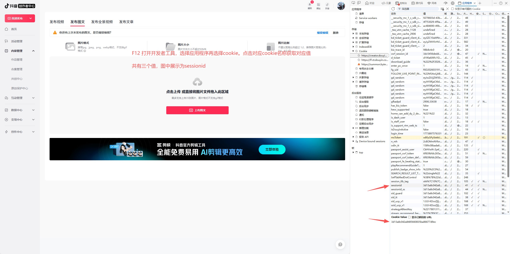
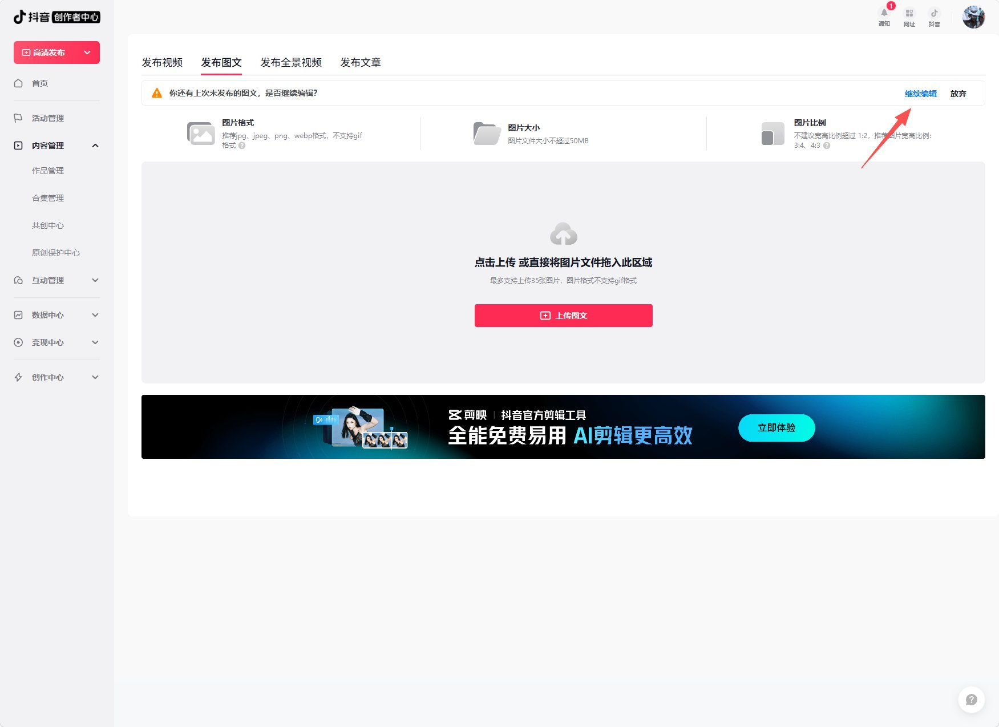
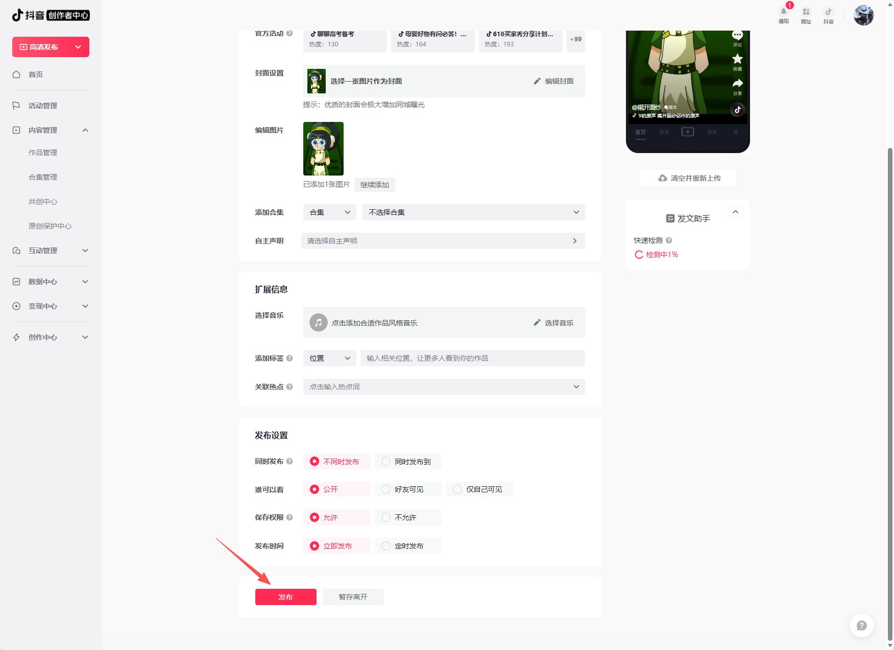
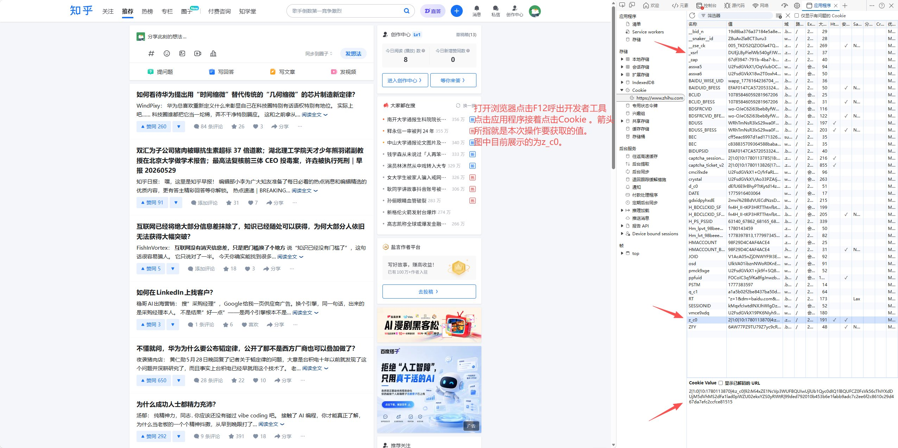
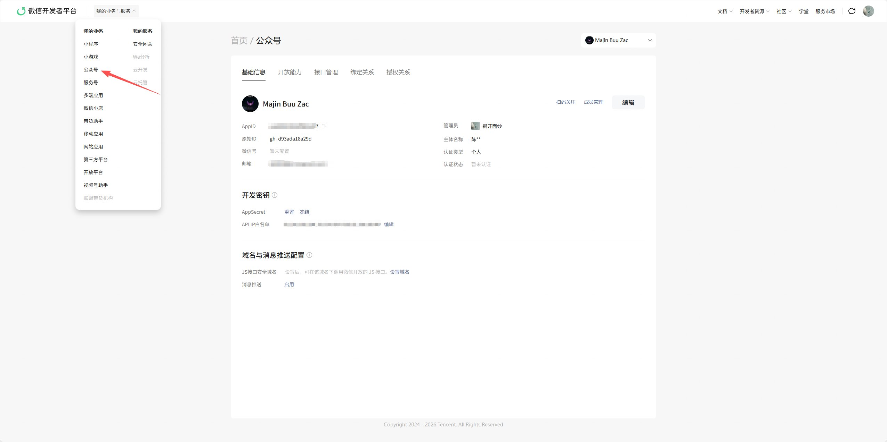
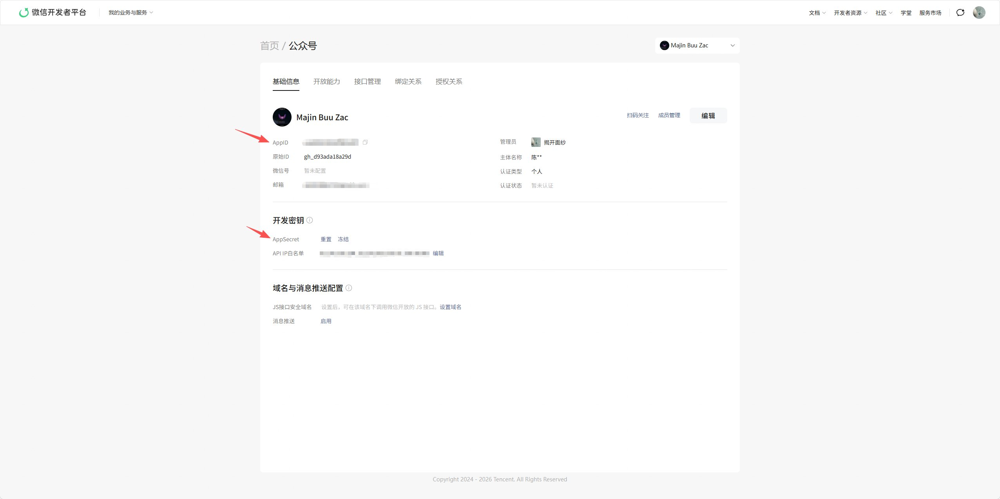
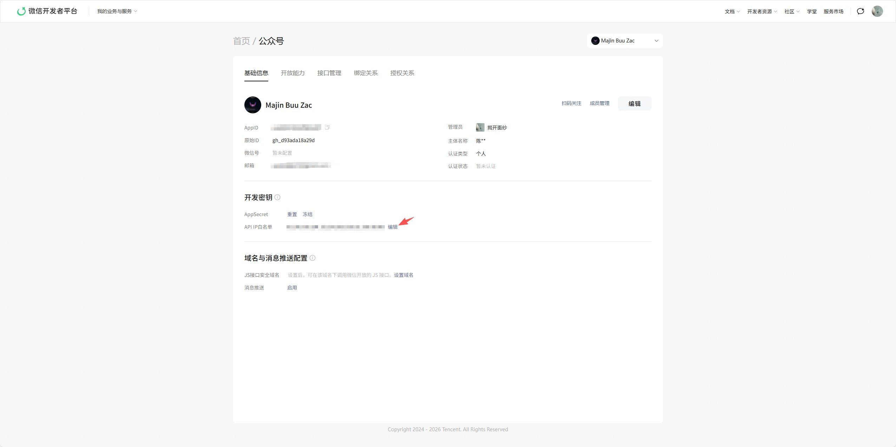
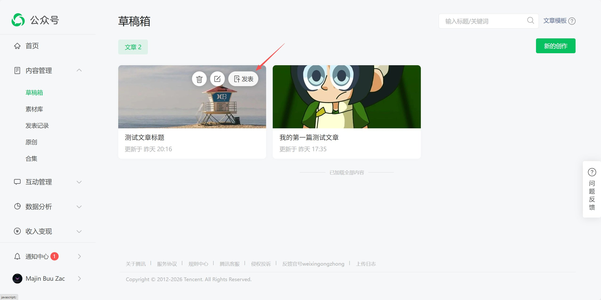

# Multi-Platform Poster Publishing Guide

This comprehensive guide will walk you through the configuration and publishing process for each supported platform. Please follow the steps below and refer to the screenshots for visual guidance.

---

## 🎵 How to publish in Douyin (抖音)

### Step 1: Obtain Platform Cookies
1. Open the [Douyin Creator Platform](https://creator.douyin.com/creator-micro/home) and log in.
2. Open Browser Developer Tools (**F12**), navigate to the **Application** tab, and select **Cookies**.
3. Copy the values for `sessionid`, `passport_csrf_token`, and `sid_guard` as highlighted in the screenshot below.

> 

 

### Step 2: Configure Account Settings
Paste the extracted cookie values into the corresponding fields in the Multi-Platform Poster account settings.

 

### Step 3: Access Drafts and Finalize Publishing
1. Go to the [Douyin Content Upload Page](https://creator.douyin.com/creator-micro/content/upload?default-tab=3).
2. Find your synced content in the draft list.
3. Click **"Continue Editing"** (继续编辑), review your content, and click **Publish**.

> 
> 

---

## 💡 How to publish in Zhihu (知乎)

### Step 1: Obtain Platform Cookies
1. Open [Zhihu](https://www.zhihu.com/) and log in.
2. Use Developer Tools to locate your cookies.
3. Copy the values for `z_c0` and `_xsrf` (as shown in the screenshot).

> 

 

### Step 2: Configure Account Settings
Enter the obtained credentials into the Zhihu account configuration form within the tool and save.

---

## 🟢 How to publish in WeChat (微信公众号)

### Step 1: Access WeChat Developer Platform
Log in to the [WeChat Official Accounts Platform](https://developers.weixin.qq.com/).

 

### Step 2: Select Official Account Service
Navigate to "My Services" or the sidebar and select the **"Official Account"** (公众号) you wish to configure.

> 

 

### Step 3: Retrieve AppID and AppSecret
Go to **Settings & Development** -> **Basic Configuration**. Note down your **AppID** and **AppSecret**. If you haven't generated one yet, click **"Generate"** or **"Reset"**.

> 

 

### Step 4: Find Your Public IP
Visit [ip.cn](https://ip.cn/) or a similar service to find the **Public IP address** of the server or machine running this tool.

 

### Step 5: Configure API IP Whitelist
Back in the WeChat **Basic Configuration** page, find the **"IP Whitelist"** section. Add your Public IP and save. **Failure to do this will result in API call rejection.**

> 

 

### Step 6: Configure Account Settings
Enter the **AppID** and **AppSecret** into the WeChat configuration form in the Multi-Platform Poster tool.

 

### Step 7: Manual Publishing (For Non-Verified Accounts)
WeChat's automated publishing API is restricted to verified enterprise or individual accounts. If your account is not verified, your articles will be synced to the **Drafts** section. You must log in to the [WeChat Admin Console](https://mp.weixin.qq.com/) and click **"Publish"** manually.

> 
