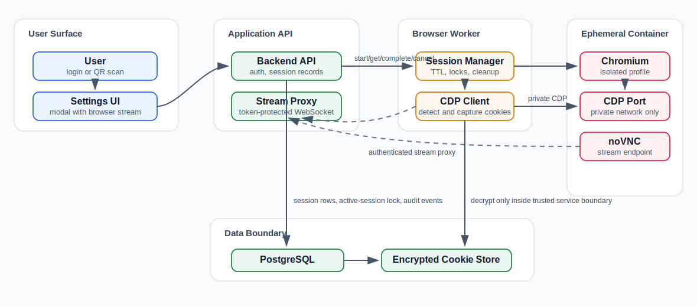

# Remote Browser Session Design

## Goal

Let users connect cookie-based publishing platforms without browser extensions or manual cookie copying.

User signs in inside an isolated remote Chromium session. The backend reads cookies from that controlled browser context through Chrome DevTools Protocol, stores them securely, then reuses them for draft creation or publishing automation.

## Non-Goals

- No browser extension.
- No scraping cookies from the user's real local browser profile.
- No user-entered platform password inside MPP forms.
- No shared browser profile between users.
- No silent publishing when platform UI requires user review.

## Recommended Stack

| Area | Technology | Why |
| --- | --- | --- |
| Browser runtime | Chromium in Docker | Isolated, reproducible, disposable per session. |
| Browser control | Existing Go `chromedp` + remote CDP | Backend already uses chromedp, but remote sessions should connect to the worker-owned browser instead of launching local backend Chromium. |
| Visual remote access | noVNC + websockify + x11vnc, or KasmVNC | Browser UI streams to user's web page without extension. |
| Virtual display | Xvfb | Runs visible Chromium inside headless server/container. |
| Session manager | Separate `browser-worker` service | Creates browser sessions, tracks TTL, stops containers, and owns CDP connectivity. Backend API remains a thin authenticated coordinator. |
| Live session state | Redis | Active sessions are short-lived and TTL-bound. Redis should own live status, active-session locks, stream tokens, heartbeats, and cleanup indexes. |
| Durable records | PostgreSQL | Stores audit/history rows, final session status, and platform account data. It is not the primary active-session lock. |
| Secret storage | Encrypted cookie store over `PlatformAccount.Cookies` | Existing model has cookie JSON, but encryption/decryption must sit behind a service boundary before MVP stores real cookies. |
| Reverse proxy | Existing frontend API proxy / Nginx / Caddy | Routes session WebSocket and HTTP control endpoints without exposing raw CDP or VNC ports. |

Preferred MVP: **one browser container per connection session**.

## Architecture



## User Flow

1. User clicks `Connect` on a platform card.
2. Backend acquires `mpp:browser:active:{user_id}:{platform}` with Redis `SET NX EX`.
3. Backend creates a durable `remote_browser_sessions` audit row with `pending` status.
4. Backend writes `mpp:browser:session:{session_id}` live state to Redis with the session TTL.
5. Backend asks `browser-worker` to start a browser container with:
   - isolated user data directory
   - adapter network policy, not only an initial allowlist URL
   - CDP endpoint reachable only by `browser-worker` on a private network
   - VNC/WebSocket endpoint reachable only through the authenticated backend stream proxy
6. Backend stores worker refs in Redis and PostgreSQL, then generates a Redis-backed stream token.
7. Frontend opens remote browser modal.
8. Chromium navigates to platform login page.
9. User logs in or scans official QR code.
10. `browser-worker` polls login state through CDP and updates Redis live state.
11. When required cookies exist, backend stores sanitized encrypted cookie JSON through the cookie store.
12. Backend marks platform account `connected`.
13. Backend asks `browser-worker` to stop the browser container after success, cancel, or TTL expiry, then releases Redis session keys.

## Session States

| State | Meaning |
| --- | --- |
| `pending` | Session record created. Container not ready. |
| `ready` | Browser stream available. User can interact. |
| `login_detected` | Required cookies or account marker found. |
| `capturing` | Cookie/profile capture is in progress. |
| `connected` | Cookies saved. Account usable. |
| `expired` | TTL ended before login. |
| `failed` | Container, CDP, or validation error. |
| `revoked` | User disconnected account. Cookies deleted. |

## Durable Data Model

PostgreSQL keeps a durable audit trail and final status. Redis is the source of truth for active locks, live status, stream tokens, and TTL-driven cleanup.

Add table:

```sql
CREATE TABLE remote_browser_sessions (
  id uuid PRIMARY KEY,
  user_id uuid NOT NULL,
  platform text NOT NULL,
  status text NOT NULL,
  worker_session_ref text NOT NULL DEFAULT '',
  container_id text NOT NULL DEFAULT '',
  cdp_endpoint_ref text NOT NULL DEFAULT '',
  stream_endpoint_ref text NOT NULL DEFAULT '',
  error_message text NOT NULL DEFAULT '',
  created_at timestamptz NOT NULL,
  expires_at timestamptz NOT NULL,
  completed_at timestamptz
);

CREATE INDEX idx_remote_browser_sessions_user_platform
ON remote_browser_sessions (user_id, platform, status);
```

Do not rely on a PostgreSQL partial unique index for active-session locking. Use Redis `SET NX EX` so stale locks expire automatically and active checks stay fast.

## Redis Live State

Use the same Redis client style already used by publish queues and OAuth state. Keys should be namespaced and should never contain raw cookies or token values.

| Key | Type | TTL | Purpose |
| --- | --- | --- | --- |
| `mpp:browser:active:{user_id}:{platform}` | string `session_id` | session TTL + small grace | One active session per user/platform. Acquired with `SET NX EX`; released by compare-and-delete Lua. |
| `mpp:browser:session:{session_id}` | hash or JSON string | session TTL + grace | Live status, owner, platform, worker refs, current URL, missing cookies, error message, and expiry. |
| `mpp:browser:stream-token:{session_id}:{token_hash}` | JSON string | `min(5 minutes, session remaining)` | Single-use stream token metadata: user ID, platform, purpose, and issued time. |
| `mpp:browser:stream-current:{session_id}` | string `token_hash` | same as stream token | Optional pointer used to rotate/revoke the latest unconsumed token. |
| `mpp:browser:cleanup` | sorted set | none | `session_id` scored by `expires_at` for deterministic cleanup sweeps. Do not rely only on keyspace notifications. |
| `mpp:browser:worker-heartbeat:{worker_session_ref}` | string | 30-60 seconds | Detect worker/container loss before the session TTL expires. |

Redis ownership rules:

- Redis owns active-session conflict checks, stream-token lifecycle, live status, worker heartbeat, and cleanup scheduling.
- PostgreSQL owns durable audit history and final queryable records.
- `browser-worker` owns actual container/CDP state.
- Cookie payloads are captured through CDP and immediately passed to `CookieStore.Save`; do not persist raw cookies in Redis.
- Every Redis lock value must include the `session_id`; release/refresh locks only when the stored value still matches the caller.

Reuse `platform_accounts.cookies` for saved cookies, but do not let publishers or handlers read raw storage directly. Add a cookie-store boundary that decrypts, validates, and returns normalized cookie arrays.

Suggested storage envelope:

```json
{
  "version": 1,
  "alg": "AES-256-GCM",
  "kid": "cookie-encryption-key",
  "nonce": "...",
  "ciphertext": "..."
}
```

Suggested decrypted cookie payload:

```json
[
  {
    "name": "sessionid",
    "value": "...",
    "domain": ".douyin.com",
    "path": "/",
    "expires": 1780000000,
    "secure": true,
    "httpOnly": true,
    "sameSite": "None"
  }
]
```

## API

### Start Session

`POST /api/user/dashboard/settings/platforms/:platform/browser-session`

Response:

```json
{
  "session_id": "uuid",
  "status": "ready",
  "stream_url": "/api/user/dashboard/browser-sessions/uuid/stream?token=...",
  "stream_token_expires_at": "2026-05-30T11:50:00Z",
  "expires_at": "2026-05-30T12:00:00Z"
}
```

Rules:

- Return `409 Conflict` if Redis already has `mpp:browser:active:{user_id}:{platform}`.
- Return `400 Bad Request` if the platform has no remote browser adapter.
- Create the PostgreSQL audit row only after the Redis active lock is acquired.
- If worker startup fails, mark the audit row `failed` and release the Redis active lock with compare-and-delete.
- Generate the first stream token in Redis when the worker stream endpoint is ready.
- The response may return `pending` for asynchronous startup or `ready` for synchronous MVP startup. Include `stream_url` only when the stream token exists.

### Get Session

`GET /api/user/dashboard/browser-sessions/:id`

Response:

```json
{
  "session_id": "uuid",
  "platform": "douyin",
  "status": "ready",
  "stream_url": "/api/user/dashboard/browser-sessions/uuid/stream?token=...",
  "stream_token_expires_at": "2026-05-30T11:50:00Z",
  "expires_at": "2026-05-30T12:00:00Z",
  "message": "Waiting for login"
}
```

Rules:

- Return only sessions owned by the authenticated user.
- Read live status from Redis first. Fall back to PostgreSQL only for terminal or already-expired sessions.
- Include `stream_url` only while status is `ready`, `login_detected`, or `capturing`.
- If the previous stream token was consumed or expired, rotate it in Redis and return a new `stream_url`.
- Return `410 Gone` when the Redis session is gone because it expired. Terminal audit states such as `connected`, `failed`, or `revoked` may return `200 OK` without `stream_url`.

### Complete Session

`POST /api/user/dashboard/browser-sessions/:id/complete`

Backend validates required cookies. Frontend may call this after user clicks `I have signed in`.

Response:

```json
{
  "session_id": "uuid",
  "platform": "douyin",
  "status": "connected",
  "account": {
    "username": "creator name",
    "avatar_url": ""
  },
  "message": "Connected"
}
```

Rules:

- Transition `ready` or `login_detected` to `capturing`.
- Ask `browser-worker` to capture cookies and account profile.
- Save only normalized encrypted cookies through `CookieStore.Save`.
- Mark the platform account `connected` only after required cookies validate.
- Return `422 Unprocessable Entity` when login cannot be detected yet.

### Cancel Session

`DELETE /api/user/dashboard/browser-sessions/:id`

Stops the worker session and marks the session `expired` or `failed`.

Response:

```json
{
  "session_id": "uuid",
  "status": "expired"
}
```

Rules:

- Stop the worker session if it is still running.
- Delete outstanding stream token keys and `mpp:browser:stream-current:{session_id}`.
- Release `mpp:browser:active:{user_id}:{platform}` by compare-and-delete.
- Remove `mpp:browser:session:{session_id}` and its cleanup sorted-set member.
- Keep completed sessions as audit records; do not delete rows in the request path.

### Stream

`GET /api/user/dashboard/browser-sessions/:id/stream?token=...`

This endpoint upgrades to WebSocket and proxies noVNC traffic to the worker-owned stream endpoint.

Rules:

- Require normal user authentication and stream token validation.
- Token must be bound to session ID, user ID, platform, and `stream` purpose.
- Token is consumed from Redis on successful WebSocket upgrade using `GETDEL` or a Lua compare-and-delete script.
- Backend must strip the token before proxying to `browser-worker`.
- Raw VNC and CDP endpoints are never returned to the browser.
- Return `401` for unauthenticated requests, `403` for owner mismatch, and `410` for consumed or expired tokens.

## Stream Token Contract

Use an opaque random token, not a JWT.

```go
type StreamToken struct {
    Token     string
    TokenHash string
    ExpiresAt time.Time
}
```

Generation and storage:

- Generate at least 32 random bytes and encode with unpadded URL-safe base64.
- Store only `SHA-256(token)` or `HMAC-SHA-256(token, STREAM_TOKEN_HASH_KEY)` in Redis under `mpp:browser:stream-token:{session_id}:{token_hash}`.
- Store token metadata as JSON: `session_id`, `user_id`, `platform`, `purpose: "stream"`, `issued_at`, and `expires_at`.
- Set token TTL to `min(5 minutes, session.expires_at - now)`.
- Never log token values or include them in worker requests.

Consumption:

- Compare token hashes in constant time.
- Reject expired or already consumed tokens by reading Redis, not PostgreSQL.
- Consume the Redis token key only after authentication and just before/while accepting the WebSocket upgrade.
- Clear `mpp:browser:stream-current:{session_id}` when the consumed hash matches the current pointer.
- For reconnect, the frontend calls `GET /api/user/dashboard/browser-sessions/:id` and receives a rotated token if the session is still active.
- Token rotation should delete the previous current token key when it is still unconsumed. Use a Lua script so the current pointer and token key change atomically.

## Browser Worker Contract

The worker API is internal only. It can be implemented as HTTP/gRPC or as an in-process Go interface for early development, but the payload shape should stay stable.

Redis responsibilities:

- Backend creates the session Redis keys before calling the worker.
- Worker updates `mpp:browser:session:{session_id}` with `status`, `current_url`, `login_detected`, `missing_cookies`, and `message` while polling CDP.
- Worker refreshes `mpp:browser:worker-heartbeat:{worker_session_ref}` while the container is alive.
- Backend cleanup sweeps `mpp:browser:cleanup` and calls `DELETE /internal/browser-sessions/:worker_session_ref` for expired sessions. The worker may also self-expire, but backend cleanup is the source of deterministic recovery.

### Start Worker Session

`POST /internal/browser-sessions`

Request:

```json
{
  "session_id": "uuid",
  "user_id": "uuid",
  "platform": "douyin",
  "login_url": "https://creator.douyin.com/creator-micro/home",
  "allowed_domains": [
    {
      "host": "creator.douyin.com",
      "match": "exact",
      "schemes": ["https"],
      "purpose": "creator"
    }
  ],
  "required_cookies": [
    {
      "name": "sessionid",
      "domain_suffixes": [".douyin.com"],
      "required": true,
      "preserve": true
    }
  ],
  "ttl_seconds": 900,
  "viewport": {
    "width": 1365,
    "height": 900
  }
}
```

Response:

```json
{
  "worker_session_ref": "worker-session-id",
  "status": "ready",
  "container_id": "container-id",
  "cdp_endpoint_ref": "private-cdp-ref",
  "stream_endpoint_ref": "private-stream-ref",
  "started_at": "2026-05-30T11:45:00Z",
  "expires_at": "2026-05-30T12:00:00Z"
}
```

### Get Worker Session

`GET /internal/browser-sessions/:worker_session_ref`

Response:

```json
{
  "worker_session_ref": "worker-session-id",
  "status": "ready",
  "current_url": "https://creator.douyin.com/creator-micro/home",
  "login_detected": false,
  "missing_cookies": ["sessionid"],
  "message": "Waiting for login"
}
```

Rules:

- Return fresh CDP-derived state when available.
- Also write that state to `mpp:browser:session:{session_id}` so normal frontend polling does not need to call the worker every time.
- If the worker heartbeat is missing or the container is gone, backend should mark the Redis session and PostgreSQL audit row `failed` or `expired` depending on whether the TTL elapsed.

### Capture Worker Session

`POST /internal/browser-sessions/:worker_session_ref/capture`

Response:

```json
{
  "status": "login_detected",
  "cookies": [
    {
      "name": "sessionid",
      "value": "...",
      "domain": ".douyin.com",
      "path": "/",
      "expires": 1780000000,
      "secure": true,
      "httpOnly": true,
      "sameSite": "None"
    }
  ],
  "account": {
    "platform_user_id": "",
    "username": "creator name",
    "avatar_url": ""
  }
}
```

Rules:

- Capture cookies with CDP network APIs, not `document.cookie`.
- Return only cookies accepted by the platform adapter.
- Do not return raw CDP endpoint details.
- If required cookies are missing, return `status: "ready"` and `missing_cookies`.
- Do not store captured cookies in Redis. The backend should pass them directly into `CookieStore.Save` after validation.

### Stop Worker Session

`DELETE /internal/browser-sessions/:worker_session_ref`

Rules:

- Stop the container.
- Delete the browser profile directory.
- Release worker-side resources even if Redis or PostgreSQL session state update fails.
- Treat repeated stop calls as idempotent.

## Platform Adapter Contract

Each cookie-based platform needs one adapter:

```go
type RemoteBrowserPlatformAdapter interface {
    Platform() string
    LoginURL() string
    AllowedDomains() []DomainRule
    RequiredCookies() []CookieRequirement
    DetectLogin(ctx context.Context, cdp BrowserCDP) (RemoteLoginState, error)
    ExtractAccount(ctx context.Context, cdp BrowserCDP) (RemoteAccountProfile, error)
}
```

`AllowedDomains` must include real login dependencies such as first-party login hosts, QR-code endpoints, captcha domains, and required static/CDN domains. It is not enough to validate only the initial navigation URL.

Shared types:

```go
type DomainRule struct {
    Host    string   `json:"host"`
    Match   string   `json:"match"` // "exact" or "suffix"
    Schemes []string `json:"schemes"`
    Purpose string   `json:"purpose"`
}

type CookieRequirement struct {
    Name           string   `json:"name"`
    DomainSuffixes []string `json:"domain_suffixes"`
    Required       bool     `json:"required"`
    Preserve       bool     `json:"preserve"`
}

type RemoteLoginState struct {
    LoggedIn       bool     `json:"logged_in"`
    Status         string   `json:"status"`
    CurrentURL     string   `json:"current_url"`
    MissingCookies []string `json:"missing_cookies"`
    Message        string   `json:"message"`
}

type RemoteAccountProfile struct {
    PlatformUserID string `json:"platform_user_id"`
    Username       string `json:"username"`
    AvatarURL      string `json:"avatar_url"`
}
```

Domain matching:

- `exact` matches only the exact host.
- `suffix` matches the exact host or a dot-boundary subdomain. For example, `douyin.com` matches `douyin.com` and `creator.douyin.com`, but not `evil-douyin.com`.
- Only `https` should be allowed for platform traffic unless an adapter explicitly documents why `http` is required.

Example requirements:

| Platform | Login URL | Required Signal |
| --- | --- | --- |
| Douyin | `https://creator.douyin.com/creator-micro/home` | creator page reachable plus required session cookies present |
| Zhihu | `https://www.zhihu.com/signin` | user avatar/account endpoint reachable plus required session cookies present |

## Douyin MVP Adapter

This adapter replaces the current manual cookie copy flow. The required cookie names are based on the existing publishing guide and must be verified with a real login smoke test before release.

### Login URL

`https://creator.douyin.com/creator-micro/home`

### Required Cookies

| Name | Domain suffix | Required | Notes |
| --- | --- | --- | --- |
| `sessionid` | `.douyin.com` | Yes | Primary authenticated session cookie. |
| `sid_guard` | `.douyin.com` | Yes | Session guard cookie. Reject when expired. |
| `passport_csrf_token` | `.douyin.com` | Yes | Required by Douyin web/auth flows. |

Optional cookies may be preserved when captured from allowed Douyin domains, but must not be used as the login success condition unless the adapter is updated with evidence from a failing smoke test.

### Allowed Domains

Initial MVP allowlist:

```json
[
  { "host": "douyin.com", "match": "suffix", "schemes": ["https"], "purpose": "first-party web and auth" },
  { "host": "douyinpic.com", "match": "suffix", "schemes": ["https"], "purpose": "images and avatars" },
  { "host": "douyinstatic.com", "match": "suffix", "schemes": ["https"], "purpose": "static assets" },
  { "host": "douyincdn.com", "match": "suffix", "schemes": ["https"], "purpose": "static assets" },
  { "host": "byteimg.com", "match": "suffix", "schemes": ["https"], "purpose": "static assets" },
  { "host": "bytegoofy.com", "match": "suffix", "schemes": ["https"], "purpose": "frontend bundles" },
  { "host": "snssdk.com", "match": "suffix", "schemes": ["https"], "purpose": "captcha and verification" },
  { "host": "bytedance.net", "match": "suffix", "schemes": ["https"], "purpose": "verification and static dependencies" }
]
```

Rules:

- Start narrow and expand only from captured failed-login traces.
- Never allow arbitrary `*.com` or URL substring matching.
- Block link-local metadata IP ranges and private service networks even when DNS resolves through an allowed host.
- Log blocked hostnames without query strings or cookie headers.

### Login Detection

The adapter reports `login_detected` only when all conditions are true:

- Current URL host suffix-matches `douyin.com`.
- Current URL path is under `/creator-micro/` or the browser can navigate there without redirecting to login.
- `sessionid`, `sid_guard`, and `passport_csrf_token` exist on an accepted Douyin domain.
- Required cookies are not expired.

If the user is on captcha, QR scan, or MFA screens, keep the session `ready` until TTL expires. Do not mark `failed` unless CDP, container, or adapter validation itself fails.

### Account Extraction

For MVP, account metadata is best-effort:

- Prefer a creator-profile endpoint or visible creator name in the creator shell when available.
- If extraction fails but required cookies validate, save the account as `Connected Douyin account` with empty `avatar_url`.
- Never block cookie save only because profile metadata is unavailable.

## Browser Container

Container process set:

- `Xvfb :99`
- `openbox` or minimal window manager
- `chromium --remote-debugging-address=0.0.0.0 --remote-debugging-port=9222 --user-data-dir=/tmp/profile --no-first-run --no-default-browser-check`
- `x11vnc -display :99 -localhost -forever`
- `websockify 6080 localhost:5900`
- noVNC static web client

Network:

- Browser can access internet.
- CDP port is never published to the host or frontend. It is reachable only from `browser-worker` through a private Docker or Kubernetes network.
- VNC/WebSocket is reachable only through the authenticated backend stream proxy.
- Container egress blocks internal service ranges, link-local metadata endpoints, and non-adapter domains where practical.
- CDP request interception enforces adapter allowlists during navigation and login. Container network policy is the second line of defense.

Resource limits:

- CPU: `0.5` to `1.0`
- Memory: `768MB` to `1.5GB`
- Session TTL: `10` to `15` minutes
- One active session per user/platform

## Redis Cleanup Flow

Redis key expiration removes stale live metadata, but cleanup must still stop containers and update durable audit rows.

1. On start, add `session_id` to `mpp:browser:cleanup` with score `expires_at_unix_ms`.
2. A backend cleanup loop periodically reads due members with `ZRANGEBYSCORE`.
3. For each due session, read `mpp:browser:session:{session_id}`. If Redis already evicted it, fall back to the PostgreSQL audit row to recover `worker_session_ref`.
4. Mark PostgreSQL `remote_browser_sessions.status = expired` unless the session already completed, failed, or was revoked.
5. Delete stream-token keys, the active lock, the live session key, heartbeat key, and the cleanup sorted-set member using compare-and-delete where ownership matters.
6. If backend crashes, Redis TTLs release locks automatically; the cleanup sorted set lets the next backend instance find containers that still need explicit stop calls.

## Security Requirements

- Require authenticated user for every session endpoint.
- Generate single-use stream token. TTL less than session TTL.
- Store active stream tokens only as SHA-256/HMAC-SHA-256 hashes in Redis, never as raw token strings.
- Use Redis compare-and-delete Lua scripts for lock release so one session cannot release another session's lock.
- Do not store raw cookies, profile screenshots, or CDP payloads in Redis.
- Never expose raw CDP URL to frontend.
- Never expose raw VNC port publicly.
- Store cookies encrypted at rest in Phase 1.
- Decrypt cookies only inside a trusted backend or browser-worker service boundary. Never log decrypted cookies or return them through API responses.
- Delete browser profile after session end.
- Block clipboard read from remote browser unless explicitly needed.
- Disable file downloads or store them in disposable temp storage.
- Enforce navigation and request allowlists through CDP interception plus container egress policy. Initial URL validation alone is insufficient.
- Audit log: session start, success, failure, cancel, cookie refresh.
- User can disconnect platform and delete cookies.

## Cookie Handling

Capture with CDP from controlled browser context after login. Include `HttpOnly` cookies. Do not use `document.cookie`.

Cookie store interface:

```go
type CookieStore interface {
    Save(ctx context.Context, userID uuid.UUID, platform string, cookies []Cookie, profile RemoteAccountProfile) error
    Load(ctx context.Context, userID uuid.UUID, platform string) ([]Cookie, error)
    Delete(ctx context.Context, userID uuid.UUID, platform string) error
}
```

Errors:

- `ErrCookieEncryptionKeyMissing`: `COOKIE_ENCRYPTION_KEY` is not configured.
- `ErrCookieValidationFailed`: required cookies are missing, expired, or outside accepted domains.
- `ErrCookieNotFound`: no saved cookies exist for the user/platform.

Normalize before storage:

- keep only required platform domains
- keep only required cookie names when possible
- drop expired cookies
- preserve `domain`, `path`, `expires`, `secure`, `httpOnly`, `sameSite`

Implementation boundary:

- `CookieStore.Save(userID, platform, cookies)` normalizes and encrypts before updating `PlatformAccount.Cookies`.
- `CookieStore.Load(userID, platform)` decrypts and returns validated cookie arrays.
- `CookieStore.Delete(userID, platform)` clears cookies, status, last test metadata, and profile metadata on disconnect.
- Existing publishers should receive decrypted cookie arrays through service code. They should not parse encrypted `PlatformAccount.Cookies` directly.

Refresh strategy:

- Try saved cookies before publishing.
- If login page appears, mark account `failed` with reconnect required.
- Do not auto-open remote session during scheduled publishing.

## Publishing Flow After Connection

1. Backend loads saved cookies.
2. Cookie store decrypts and validates cookies.
3. Existing publisher uses decrypted cookies with chromedp.
4. Publisher creates draft.
5. If platform requires review, return `manual_review_required` with remote draft URL.
6. UI shows `Open draft` action.

## Frontend UX

Settings card:

- `Connect`
- `Connected as <account>`
- `Reconnect`
- `Disconnect`
- `Last checked`

Remote modal:

- large browser viewport
- top status bar: platform, session time left, connection state
- actions: `I have signed in`, `Cancel`
- no instructions about cookies

Failure messages:

- `Login not detected`
- `Session expired`
- `Platform changed its login flow`
- `Cookies saved but publishing test failed`

## Implementation Plan

### Phase 1: MVP

- Add `remote_browser_sessions` PostgreSQL audit table.
- Add Redis-backed browser session store for live state, active-session locks, stream tokens, worker heartbeats, and cleanup indexes.
- Use Redis `SET NX EX` for one active session per user/platform.
- Use Redis single-use stream tokens with 5-minute max TTL and atomic consume/rotation.
- Add encrypted cookie store over `PlatformAccount.Cookies`.
- Add `browser-worker` session manager interface.
- Add Docker image for remote browser runtime.
- Add private CDP connectivity from `browser-worker` to browser containers.
- Add CDP request interception and adapter domain allowlists.
- Add start/get/complete/cancel APIs.
- Add one adapter for Douyin.
- Add settings modal with noVNC iframe.
- Save encrypted cookies into `PlatformAccount.Cookies`.
- Reuse existing Douyin publisher with cookie-store-loaded cookies.
- Add cleanup loop that drains `mpp:browser:cleanup`, stops expired worker sessions, and releases Redis locks.

### Phase 2: Hardening

- Add per-session resource limits.
- Add audit logs.
- Add adapter tests with mocked CDP.
- Add reconnect-required status in UI.
- Add Redis metrics/alerts for active sessions, cleanup lag, token-consume failures, and worker heartbeat loss.

### Phase 3: More Platforms

- Add Zhihu adapter.
- Add Xiaohongshu adapter.
- Add reusable draft automation contract.
- Add manual review handoff URLs.

## Open Decisions

| Decision | Recommendation |
| --- | --- |
| noVNC vs KasmVNC | Use noVNC for MVP. Switch to KasmVNC only if performance or mobile input is poor. |
| Browser worker location | Separate `browser-worker` service. Keep backend API thin and reuse the worker for publishing later if local backend Chromium becomes unreliable. |
| Cookie encryption | Application-level AES-GCM using `COOKIE_ENCRYPTION_KEY`, implemented in Phase 1 before storing real platform cookies. |
| Active session coordination | Redis owns live locks, stream tokens, TTL state, and cleanup indexes. PostgreSQL is durable history only. |
| Container orchestration | Docker Compose for dev; Kubernetes Jobs/Pods for production. |
| Session persistence | Persist cookies and audit rows only. Redis live state expires; browser profiles are deleted after connect, cancel, or TTL. |

## Acceptance Criteria

- User connects Douyin without copying cookies.
- User sees official login page inside remote browser modal.
- Backend captures required cookies after login.
- Cookies are saved on `PlatformAccount`.
- Remote container stops after success, cancel, or TTL.
- Reconnect is required when cookies expire.
- No browser extension is required.
