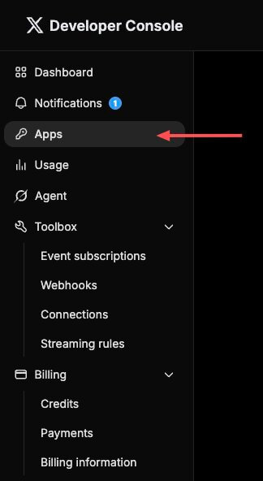
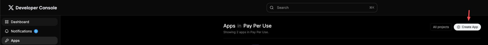

# How to get X oauth2-client

## Step 1

Open [X official developer console](https://console.x.com/)

## Step 2 create a APP

click the app in nav, and then create a app

## Step 3

open the panel of the app
click "Settings" button
set app permissions as read and write
type Callback URI / Redirect URL and Website URL
and then click "save changes"
finally you're gonna get Client ID and Client Secret of this app
